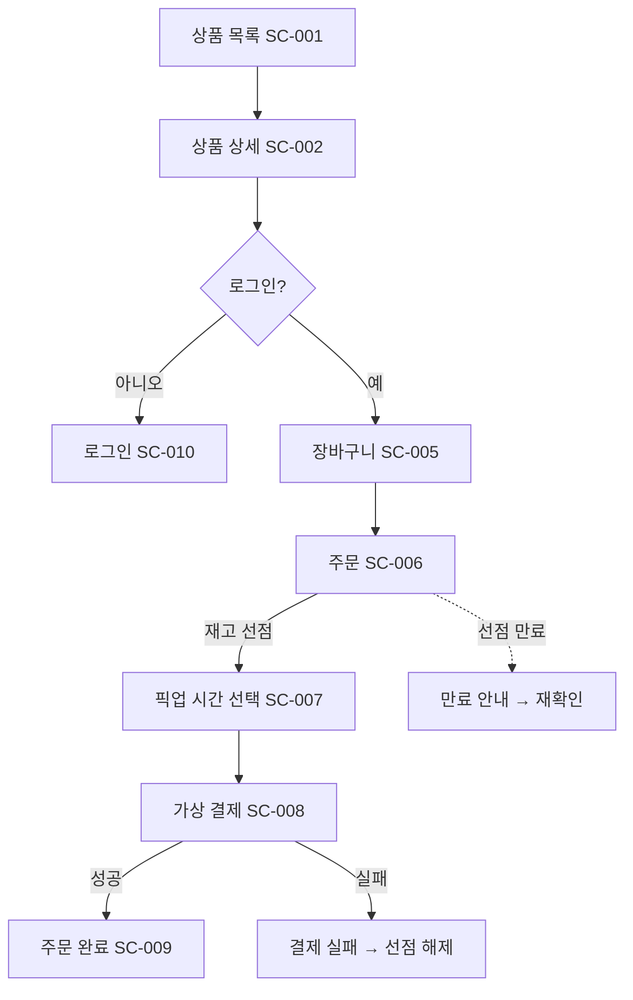

# 화면 목록 · 사용자 흐름 형식

## 화면 목록표

```markdown
| ID | 화면 | 사용자 | 진입 경로 | 주요 액션 | 관련 FR |
|---|---|---|---|---|---|
| SC-001 | 상품 목록 | 고객/비로그인 | 앱 진입, 검색 취소 | 상품 선택, 검색, 정렬 | FR-004, FR-006 |
```

`사용자` 값은 `고객`, `관리자`, `비로그인`, 또는 조합으로만 쓴다.

## 화면 상세

각 화면마다 아래를 채운다.

```markdown
### SC-001 · 상품 목록

- 사용자: 고객, 비로그인
- 진입: 앱 실행 / 검색 화면 취소 / 주문 완료 후 "계속 쇼핑"
- 이탈: 상품 상세(SC-002), 장바구니(SC-005), 로그인(SC-010)

**표시 정보**
- 상품명, 원가, 마감 할인가, 할인율, 잔여 수량, 픽업 가능 여부

**상태**
| 상태 | 표시 |
|---|---|
| 기본 | 할인 상품 카드 목록 |
| 로딩 | 카드 스켈레톤 6개 |
| 비어 있음 | "오늘 마감 할인 상품이 아직 없어요" + 알림 받기 |
| 재고 소진 상품 | 카드 흐림 처리, "품절" 배지, 선택 불가 |
| 오류 | 재시도 버튼과 함께 오류 메시지 |
```

**빈 상태·로딩·오류를 빠뜨린 화면은 완성으로 보지 않는다.**

## 반드시 정의해야 할 예외 상태

| 상황 | 나타나는 화면 |
|---|---|
| 재고 소진 | 목록, 상세, 장바구니, 주문 |
| 선점 만료 | 주문, 결제 |
| 픽업 시간대 마감 | 픽업 시간 선택 |
| 가상 결제 실패 | 결제 결과 |
| 비로그인 상태에서 주문 시도 | 장바구니, 주문 |
| 관리자 권한 없음 | 관리자 전 화면 |

## 요구사항 매핑표 (화면 목록 문서 끝에 필수)

```markdown
## FR ↔ 화면 매핑

| FR | 화면 |
|---|---|
| FR-001 | SC-010, SC-011 |
| FR-014 | SC-006 |

미매핑 요구사항: 없음
```

미매핑이 있으면 개수와 사유를 반드시 적는다.

## 사용자 흐름 다이어그램

고객 흐름과 관리자 흐름을 **별도 다이어그램**으로 그린다. 한 그림에 합치지 않는다.



규칙:
- 노드에 화면 ID를 함께 적는다
- 정상 경로는 실선, 예외·타임아웃 경로는 점선(`-.->`)
- 분기에는 조건을 적는다
- 흐름마다 `FL-###` ID를 부여하고 시작·종료 조건을 문장으로 적는다

## 모바일 우선

기준 폭 360px. 화면 상세에 다음을 명시한다.
- 한 화면에 들어가는 주요 정보의 개수
- 스크롤 없이 보여야 하는 요소 (가격, 잔여 수량, 주요 CTA)
- 하단 고정 액션 바 사용 여부

## 검토 체크

- [ ] 모든 화면에 ID, 사용자, 진입·이탈, 상태 4종이 있다
- [ ] 예외 상태 6개가 모두 어딘가에 정의되었다
- [ ] FR↔화면 매핑표가 있고 미매핑이 0이다
- [ ] 고객·관리자 흐름이 분리되었다
- [ ] 모든 흐름에 예외 경로가 그려졌다
