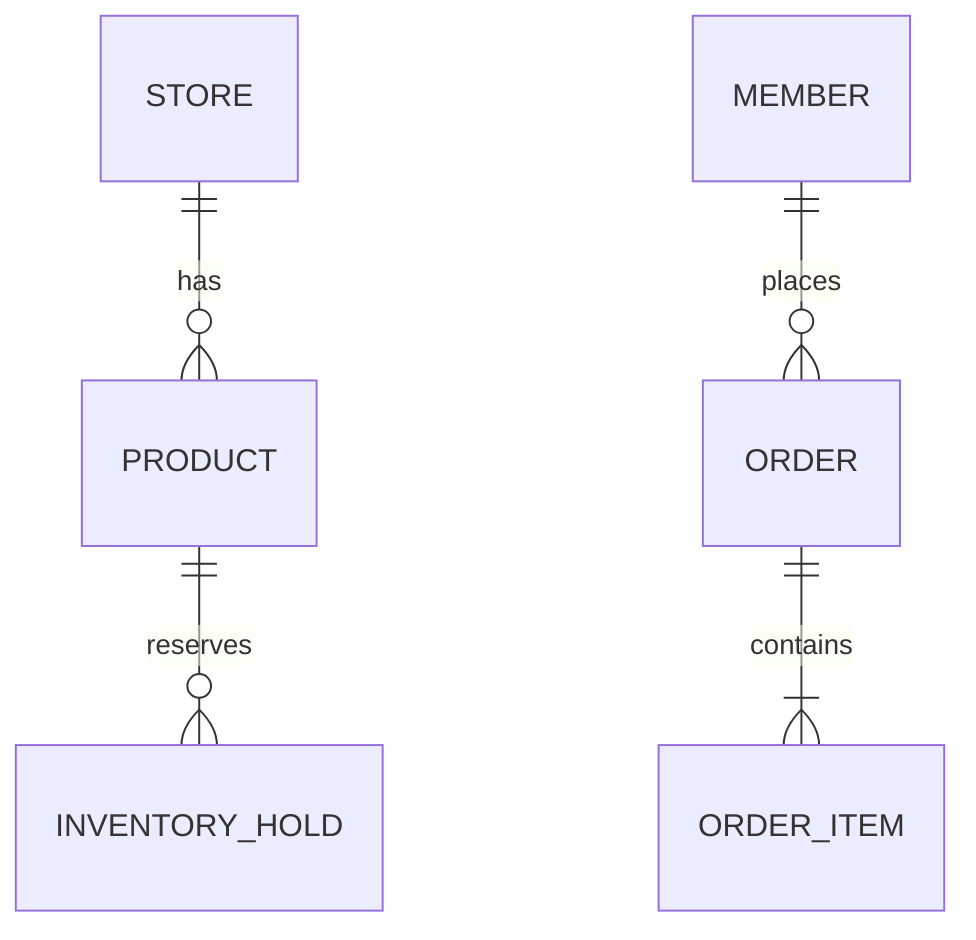

# 기술 설계 문서 형식

## ERD



다이어그램 아래에 엔티티마다 표를 붙인다.

```markdown
### PRODUCT

| 컬럼 | 타입 | 제약 | 설명 |
|---|---|---|---|
| id | BIGINT | PK | |
| store_id | BIGINT | FK, NOT NULL | |
| stock_qty | INT | NOT NULL, >= 0 | 실재고 |
| expires_at | TIMESTAMP | NOT NULL | 마감 시각 |

- 인덱스: `(store_id, expires_at)` — 마감 임박 목록 조회
- 불변 조건: `stock_qty >= 0`, `discount_price <= original_price`
```

규칙:
- 모든 엔티티에 PK와 최소 1개 불변 조건을 적는다
- 재고·금액 컬럼에는 반드시 제약을 건다
- 상태 컬럼의 허용값을 `05-state-rules.md`의 상태명과 **문자 그대로 일치**시킨다
- 인덱스에는 그 인덱스가 필요한 조회를 함께 적는다

## API 명세

````markdown
### API-012 · 주문 생성

- `POST /api/orders`
- 권한: 고객 (로그인 필수)
- 관련 요구사항: FR-014, FR-016
- 관련 규칙: BR-007, BR-008

**요청**
```json
{ "items": [{ "productId": 1, "quantity": 2 }], "pickupSlotId": 34 }
```

**응답 (201)**
```json
{ "orderId": 1001, "status": "PENDING", "holdExpiresAt": "2026-08-28T15:10:00+09:00" }
```

**오류**
| 코드 | HTTP | 조건 | 규칙 |
|---|---|---|---|
| OUT_OF_STOCK | 409 | 요청 수량 > 가용 재고 | BR-008 |
| SLOT_CLOSED | 409 | 픽업 시간대 마감 | BR-011 |
````


규칙:
- 고객용 `/api/...`, 관리자용 `/api/admin/...`으로 경로를 분리한다
- 모든 오류 코드는 `BR-###`와 연결한다. 연결되지 않는 오류는 규칙이 빠졌다는 신호다
- 응답에 화면이 필요로 하는 필드가 다 있는지 확인한다 (잔여 수량, 할인가, 선점 만료 시각 등)
- 문서 끝에 `FR ↔ API` 매핑표를 둔다

## 인증 · 권한

```markdown
| 리소스 / 액션 | 비로그인 | 고객 | 관리자 |
|---|---|---|---|
| 상품 목록 조회 | O | O | O |
| 주문 생성 | X | O | X |
| 재고 수정 | X | X | O |
```

함께 적을 것: 인증 방식, 토큰/세션 수명과 갱신, 로그아웃 처리, 권한 없음 응답 코드(401/403 구분).

## 재고 동시성

아래 6개 시나리오에 **각각** 절을 만든다. 하나라도 비우지 않는다.

1. 임시 선점의 저장 위치와 구조
2. 선점 TTL과 만료 회수 방식
3. 마지막 재고 동시 주문 (락 전략)
4. 가상 결제 실패 시 선점 해제
5. 주문 취소 시 재고 복구와 멱등성
6. 관리자 재고 수정과 진행 중 주문의 충돌

각 절의 형식:

```markdown
### 3. 마지막 재고 동시 주문

**문제**
두 고객이 같은 순간에 잔여 1개 상품을 주문한다.

**선택한 방식**
(구체적으로. 어떤 쿼리/락/제약이 무엇을 막는지)

**왜 이 방식인가**

**포기한 대안과 이유**

**실패 시 사용자에게 보이는 것**
OUT_OF_STOCK 오류 → 상세 화면에서 품절 상태로 전환
```

"낙관적 락을 쓴다"로 끝내지 않는다. 어떤 컬럼으로, 충돌하면 무엇을 반환하는지까지 적는다.

## 프로젝트 구조

폴더 트리와 함께 각 계층의 책임, 의존 방향, 명명 규칙을 적는다.
재고 선점 로직이 어느 계층에 있는지 명시한다.

## 검토 체크

- [ ] 모든 엔티티에 PK·제약·불변 조건이 있다
- [ ] 상태값 이름이 05번 문서와 일치한다
- [ ] 모든 API에 권한·요청·응답·오류표가 있다
- [ ] 모든 오류 코드가 BR과 연결되었다
- [ ] 동시성 6개 시나리오가 모두 채워졌다
- [ ] FR ↔ API 매핑표가 있고 미매핑이 0이다
