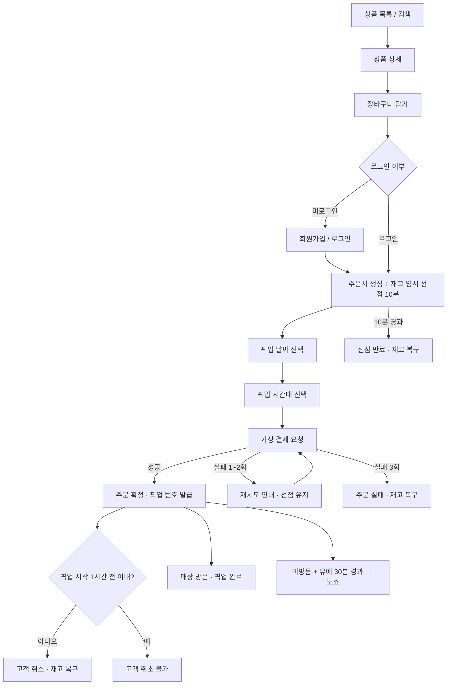
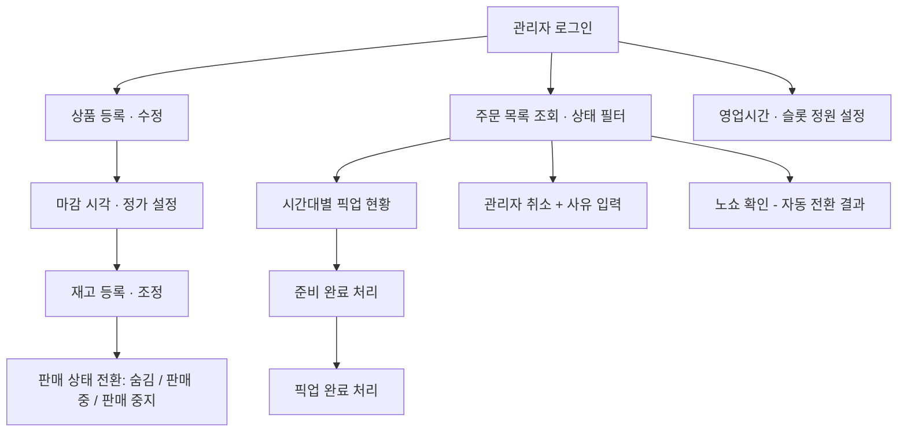

# savePick 사용자 시나리오

- 문서 ID: 02
- 작성: product-planner
- 최종 갱신: 2026-08-28
- 선행 문서: 01

## 한 줄 요약
고객과 관리자가 savePick에서 겪는 정상 흐름과 예외 흐름을 각각 분리해 서술한다.

---

## 0. 등장 인물과 공통 전제

| 구분 | 이름 | 설명 |
|---|---|---|
| 고객 | 지현 | 매장에서 도보 10분 거리에 사는 직장인. 퇴근길에 저녁 재료를 산다 |
| 고객 | 민수 | 처음 방문한 신규 사용자. 계정이 없다 |
| 관리자 | 상현 | 매장 운영자. 개점과 마감 시간대에 상품·재고·주문을 관리한다 |

공통 전제

- 매장은 1곳이며 모든 픽업은 이 매장에서 이뤄진다.
- 모든 시각은 매장 기준 시각(KST)이며, 판정 기준은 서버 시각이다.
- 결제는 성공·실패 결과만 돌려주는 가상 결제다.
- 고객 시나리오와 관리자 시나리오는 서로 다른 진입 경로를 쓰며 섞이지 않는다.

---

## 1. 고객 시나리오

### 1.1 CS-01 · 신규 가입 후 첫 주문 (정상 흐름)

**상황** 민수가 오후 7시에 처음 서비스를 열어 오늘 저녁거리를 산다.

| 단계 | 민수의 행동 | 서비스의 응답 |
|---|---|---|
| 1 | 서비스에 접속해 상품 목록을 본다 | 판매 중인 상품을 마감 임박 순으로 보여주고, 상품마다 정가·현재 할인가·할인율·잔여 수량·마감 시각을 표시한다 |
| 2 | "삼겹살"을 검색한다 | 상품명에 검색어를 포함한 판매 중 상품만 보여준다 |
| 3 | 상품 상세를 연다 | 상품 정보, 현재 할인가, 잔여 수량, 마감 시각, 1회 주문 가능 최대 수량을 보여준다 |
| 4 | 수량 2개를 장바구니에 담는다 | 장바구니에 담는다. 이 시점에는 재고를 선점하지 않으며 잔여 수량도 줄지 않는다 |
| 5 | 채소 1개를 추가로 담는다 | 장바구니에 2개 품목이 담긴다 |
| 6 | 주문하기를 누른다 | 로그인이 필요하다고 알린다 |
| 7 | 회원가입을 한다 | 계정을 만들고 로그인 상태로 만든 뒤, 담아 둔 장바구니를 그대로 유지한다 |
| 8 | 다시 주문하기를 누른다 | 장바구니 전 품목의 재고와 현재 할인가를 재확인한 뒤 주문서를 만들고, 담긴 수량만큼 재고를 임시 선점한다. 남은 선점 시간(10분)을 표시한다 |
| 9 | 픽업 날짜로 오늘을 고른다 | 오늘과 내일 중 선택하게 하고, 오늘을 고르면 오늘의 예약 가능 시간대만 남긴다 |
| 10 | 픽업 시간대로 20:00~20:30을 고른다 | 이미 마감된 시간대, 정원이 찬 시간대, 상품 마감 시각을 넘긴 시간대는 선택할 수 없게 한다 |
| 11 | 결제하기를 누른다 | 가상 결제를 요청하고 성공 결과를 받는다 |
| 12 | 주문 완료 화면을 본다 | 주문 번호, 픽업 번호, 픽업 날짜·시간대, 결제 금액, 취소 가능 마감 시각을 보여준다. 선점 수량이 확정 차감으로 바뀐다 |
| 13 | 20:10에 매장에 방문해 픽업 번호를 말한다 | 관리자가 픽업 완료로 처리하고 주문이 완료 상태가 된다 |

**성공 조건** 민수는 주문한 수량 전부를 지정한 시간대에 받고, 결제 금액은 8단계에서 확정된 금액과 같다.

### 1.2 CS-02 · 선점 시간이 만료된 경우 (예외 흐름)

**상황** 지현이 주문서까지 만든 뒤 다른 일을 처리하다가 10분을 넘긴다.

| 단계 | 지현의 행동 | 서비스의 응답 |
|---|---|---|
| 1 | 주문서를 만든다 | 재고를 선점하고 남은 시간 10분을 표시한다 |
| 2 | 화면을 켜 둔 채 자리를 비운다 | 남은 시간 1분 시점에 곧 만료된다고 알린다 |
| 3 | 12분 뒤 결제하기를 누른다 | 선점이 만료됐다고 알리고 결제를 진행하지 않는다. 선점 수량은 이미 다른 고객이 구매할 수 있도록 복구돼 있다 |
| 4 | 다시 주문하기를 누른다 | 현재 재고와 현재 할인가로 주문서를 새로 만든다. 재고가 부족한 품목이 있으면 어떤 품목이 몇 개 부족한지 알린다 |
| 5 | 부족한 품목을 빼고 진행한다 | 남은 품목으로 주문서를 다시 만들고 선점 시간을 새로 부여한다 |

**성공 조건** 지현은 만료 사실을 결제 시도 전에 알고, 만료된 선점 수량은 3단계 시점에 이미 다른 고객에게 노출된다.

### 1.3 CS-03 · 가상 결제가 실패한 경우 (예외 흐름)

**상황** 지현이 결제하기를 눌렀는데 가상 결제가 실패를 반환한다.

| 단계 | 지현의 행동 | 서비스의 응답 |
|---|---|---|
| 1 | 결제하기를 누른다 | 가상 결제가 실패를 반환한다 |
| 2 | 실패 안내를 본다 | 결제가 실패했음을 알리고, 선점은 남은 유효 시간까지 유지되며 재시도할 수 있다고 안내한다. 남은 시간과 남은 재시도 횟수를 함께 보여준다 |
| 3 | 다시 결제하기를 누른다 | 두 번째 시도도 실패하면 같은 안내를 반복한다 |
| 4 | 세 번째로 결제하기를 누른다 | 세 번째도 실패하면 주문을 결제 실패로 종료하고 선점을 즉시 해제해 재고를 복구한다 |
| 5 | 처음부터 다시 주문한다 | 현재 재고와 현재 할인가로 새 주문서를 만든다 |

**성공 조건** 3회 실패 또는 선점 만료 중 먼저 오는 시점에 재고가 복구되며, 실패한 주문으로는 픽업할 수 없다.

### 1.4 CS-04 · 마지막 1개를 두 고객이 동시에 주문 (예외 흐름)

**상황** 특정 상품의 잔여 수량이 1개이고, 지현과 민수가 거의 동시에 주문서를 만든다.

| 단계 | 상황 | 서비스의 응답 |
|---|---|---|
| 1 | 두 사람이 같은 상품 1개를 담은 상태 | 두 사람 모두 잔여 수량 1개를 본다 |
| 2 | 두 사람이 동시에 주문하기를 누른다 | 먼저 처리된 1명만 선점에 성공한다 |
| 3 | 실패한 쪽이 결과를 본다 | 해당 상품이 품절돼 주문서를 만들 수 없다고 알린다. 부분 선점은 만들지 않는다 |
| 4 | 성공한 쪽이 결제까지 마친다 | 상품 잔여 수량이 0이 되고 목록에서 품절로 표시된다 |
| 5 | 성공한 쪽의 선점이 만료되거나 결제가 최종 실패한다 | 잔여 수량이 1개로 복구되고 다시 판매 가능 상태가 된다 |

**성공 조건** 어떤 경우에도 확정된 주문 수량의 합이 관리자가 등록한 재고 수량을 넘지 않는다.

### 1.5 CS-05 · 주문을 취소하는 경우 (정상 흐름)

**상황** 지현이 20:00~20:30 픽업으로 주문했는데 18:30에 야근이 결정된다.

| 단계 | 지현의 행동 | 서비스의 응답 |
|---|---|---|
| 1 | 주문 내역에서 해당 주문을 연다 | 주문 상태, 픽업 시간대, 취소 가능 마감 시각(19:00)을 보여준다 |
| 2 | 취소하기를 누른다 | 취소 시 전액 취소되며 부분 취소는 불가하다고 안내하고 확인을 요구한다 |
| 3 | 확인한다 | 주문을 취소 상태로 바꾸고, 취소한 수량을 즉시 판매 가능 재고로 복구한다. 점유하던 픽업 슬롯 정원 1건도 반납한다 |
| 4 | 목록을 다시 본다 | 취소한 상품의 잔여 수량이 늘어난 것을 확인한다 |

**성공 조건** 취소 직후 다른 고객이 같은 수량을 주문할 수 있다.

### 1.6 CS-06 · 취소 가능 시각이 지난 경우 (예외 흐름)

**상황** 지현이 19:40에 같은 주문을 취소하려 한다. 픽업 시작은 20:00이다.

| 단계 | 지현의 행동 | 서비스의 응답 |
|---|---|---|
| 1 | 주문 상세를 연다 | 취소 버튼을 사용할 수 없는 상태로 두고, 취소 가능 시각이 19:00에 지났다고 알린다 |
| 2 | 매장에 전화해 취소를 요청한다 | (서비스 밖 행위) |
| 3 | 관리자가 대신 취소한다 | 관리자 취소 사유를 남기고 주문을 취소 상태로 바꾼다. 재고 복구 여부는 상품 마감 시각 도달 여부에 따라 결정된다 |

**성공 조건** 고객은 취소 불가 사유와 기준 시각을 화면에서 확인할 수 있고, 시스템이 임의로 취소를 허용하지 않는다.

### 1.7 CS-07 · 픽업하지 않은 경우 (예외 흐름)

**상황** 민수가 20:00~20:30 픽업으로 주문했으나 방문하지 않는다.

| 단계 | 시각 | 서비스의 응답 |
|---|---|---|
| 1 | 20:30 | 픽업 시간대가 끝났지만 주문은 아직 확정 상태를 유지한다 (유예 30분) |
| 2 | 21:00 | 노쇼 상태로 자동 전환한다. 결제 금액은 환불하지 않고 재고도 복구하지 않는다 |
| 3 | 21:00 이후 | 민수의 주문 내역에 노쇼로 표시하고 사유를 안내한다 |
| 4 | 노쇼 3회 누적(최근 30일) | 이후 7일간 새 주문을 만들 수 없게 하고, 제한 해제 예정 시각을 알린다 |

**성공 조건** 노쇼 처리 이후에는 해당 주문으로 픽업할 수 없고, 노쇼 수량이 다시 판매되지 않는다.

### 1.8 고객 흐름 요약

---

## 2. 관리자 시나리오

### 2.1 AS-01 · 개점 시 상품과 재고 등록 (정상 흐름)

**상황** 상현이 오전 9시 30분에 오늘 판매할 마감 임박 상품을 등록한다.

| 단계 | 상현의 행동 | 서비스의 응답 |
|---|---|---|
| 1 | 관리자 기능에 로그인한다 | 관리자 권한을 확인하고 관리자 기능만 사용할 수 있게 한다 |
| 2 | 상품을 새로 등록한다 | 상품명, 설명, 정가, 단위, 마감 시각, 1회 주문 최대 수량을 입력받는다 |
| 3 | 마감 시각을 오늘 21:00으로 지정한다 | 마감 시각이 현재보다 과거이면 저장하지 않고 오류로 알린다 |
| 4 | 재고 수량 20개를 등록한다 | 판매 가능 재고를 20개로 만든다 |
| 5 | 판매 상태를 판매 중으로 바꾼다 | 고객 목록에 노출되기 시작한다. 이 시점부터 마감까지 남은 시간에 따라 할인율이 자동 적용된다 |
| 6 | 고객 화면 기준 가격을 확인한다 | 마감까지 11시간 30분이 남아 할인율 30%가 적용된 가격을 확인한다 |

**성공 조건** 등록한 상품은 판매 중 상태에서만 고객에게 노출되고, 할인율은 상현이 수동으로 계산하지 않아도 적용된다.

### 2.2 AS-02 · 재고를 조정하는 경우 (예외 흐름)

**상황** 실제 진열 수량이 20개가 아니라 17개임을 확인하고 상현이 재고를 줄인다.

| 단계 | 상현의 행동 | 서비스의 응답 |
|---|---|---|
| 1 | 재고 현황을 연다 | 총 재고, 판매 가능 수량, 선점 중 수량, 확정 판매 수량을 나눠서 보여준다 |
| 2 | 총 재고를 17개로 줄인다 | 판매 가능 수량 범위 안이면 그대로 반영한다 |
| 3 | 총 재고를 5개로 줄이려 한다 (이미 확정 6개, 선점 2개) | 확정 수량과 선점 수량의 합인 8개 미만으로는 줄일 수 없다고 거부한다 |
| 4 | 총 재고를 8개로 줄인다 | 반영하고 판매 가능 수량을 0으로 만든다. 이미 만들어진 선점과 확정 주문은 그대로 지킨다 |
| 5 | 실물이 파손돼 즉시 판매를 멈춰야 한다 | 판매 상태를 판매 중지로 바꾼다. 신규 주문서 생성만 막고 기존 확정 주문은 유지한다 |

**성공 조건** 이미 선점되거나 확정된 수량은 관리자의 재고 축소로 취소되지 않는다.

### 2.3 AS-03 · 픽업 준비와 수령 처리 (정상 흐름)

**상황** 상현이 19:50에 20:00~20:30 시간대 픽업을 준비한다.

| 단계 | 상현의 행동 | 서비스의 응답 |
|---|---|---|
| 1 | 오늘의 시간대별 픽업 현황을 연다 | 시간대마다 예약 건수, 정원, 상품별 합계 수량을 보여준다 |
| 2 | 20:00~20:30 주문 목록을 연다 | 해당 시간대 확정 주문을 픽업 번호와 함께 보여준다 |
| 3 | 상품을 담고 준비 완료로 표시한다 | 주문을 준비 완료 상태로 바꾼다 |
| 4 | 방문한 고객의 픽업 번호로 주문을 찾는다 | 픽업 번호로 해당 주문을 찾아 보여준다 |
| 5 | 픽업 완료로 처리한다 | 주문을 완료 상태로 바꾼다. 재고는 이미 확정 차감돼 있어 변화가 없다 |
| 6 | 완료된 주문을 다시 취소하려 한다 | 완료 상태에서는 취소할 수 없다고 거부한다 |

**성공 조건** 픽업 완료 처리는 되돌릴 수 없으며, 같은 주문을 두 번 완료 처리할 수 없다.

### 2.4 AS-04 · 노쇼 정리 (정상 흐름)

**상황** 상현이 22:00 마감 정리 중 미수령 주문을 확인한다.

| 단계 | 상현의 행동 | 서비스의 응답 |
|---|---|---|
| 1 | 오늘 주문을 상태로 걸러 본다 | 노쇼로 자동 전환된 주문 목록을 보여준다 |
| 2 | 유예 시간이 아직 남은 미수령 주문을 본다 | 확정 상태로 남아 있고 노쇼 전환 예정 시각을 함께 보여준다 |
| 3 | 고객이 늦게 도착해 수령을 요청한다 (유예 시간 내) | 픽업 완료로 처리할 수 있게 한다 |
| 4 | 유예 시간이 지난 주문을 수동으로 노쇼 처리한다 | 이미 자동 전환됐으면 중복 처리하지 않고 현재 상태를 알린다 |
| 5 | 노쇼 수량의 실물을 폐기한다 | (서비스 밖 행위) 노쇼 수량은 판매 가능 재고로 복구하지 않는다 |

**성공 조건** 노쇼 판정은 자동으로 이뤄지고, 관리자의 수동 조작 없이도 상태가 정리된다.

### 2.5 AS-05 · 관리자가 주문을 취소하는 경우 (예외 흐름)

**상황** 상품 이상이 발견돼 상현이 특정 주문을 취소해야 한다.

| 단계 | 상현의 행동 | 서비스의 응답 |
|---|---|---|
| 1 | 주문 상세를 연다 | 주문 상태와 취소 가능 여부를 보여준다 |
| 2 | 취소를 실행하고 사유를 입력한다 | 고객 취소 마감 시각이 지났더라도 관리자는 취소할 수 있게 한다. 사유는 필수로 받는다 |
| 3 | 결과를 확인한다 | 주문을 취소 상태로 바꾸고, 상품 마감 시각 전이면 재고를 복구하고 마감 시각이 지났으면 복구하지 않는다 |
| 4 | 이미 완료된 주문을 취소하려 한다 | 거부한다 |

**성공 조건** 관리자 취소에는 항상 사유가 남고, 재고 복구 여부가 기록으로 확인된다.

### 2.6 AS-06 · 픽업 슬롯 운영 설정 (정상 흐름)

**상황** 상현이 다음 주 픽업 운영 조건을 조정한다.

| 단계 | 상현의 행동 | 서비스의 응답 |
|---|---|---|
| 1 | 영업시간을 확인한다 | 현재 설정된 영업시간(10:00~22:00)을 보여준다 |
| 2 | 슬롯 정원을 20건에서 12건으로 줄인다 | 이후 생성되는 주문부터 적용한다. 이미 정원을 넘겨 예약된 기존 주문은 취소하지 않는다 |
| 3 | 특정 시간대를 닫는다 | 해당 시간대를 신규 선택에서 제외한다. 기존 예약은 유지한다 |
| 4 | 영업 종료 시각을 21:00으로 당긴다 | 21:00 이후 시작하는 시간대를 신규 선택에서 제외한다 |

**성공 조건** 운영 설정 변경이 이미 확정된 주문의 픽업 시간을 바꾸거나 취소하지 않는다.

### 2.7 관리자 흐름 요약

---

## 3. 고객 흐름과 관리자 흐름의 접점

두 흐름은 아래 지점에서만 만난다. 그 외에는 서로의 화면·기능을 공유하지 않는다.

| # | 접점 | 고객 쪽 결과 | 관리자 쪽 결과 |
|---|---|---|---|
| T1 | 상품 판매 상태 변경 | 목록 노출 여부가 바뀐다 | 판매 상태를 직접 바꾼다 |
| T2 | 재고 수량 조정 | 잔여 수량 표시가 바뀐다 | 총 재고를 직접 바꾼다 |
| T3 | 주문 확정 | 픽업 번호를 받는다 | 준비할 주문 목록에 추가된다 |
| T4 | 픽업 완료 처리 | 주문 상태가 완료로 바뀐다 | 픽업 번호로 조회해 처리한다 |
| T5 | 관리자 취소 | 취소 안내와 사유를 확인한다 | 사유를 입력해 취소한다 |
| T6 | 노쇼 자동 전환 | 노쇼 표시와 제재 안내를 확인한다 | 노쇼 목록에서 확인한다 |

---

## 가정 / 미확정

### 가정 (확인 필요)

| # | 가정한 내용 | 근거 | 틀릴 경우 영향 |
|---|---|---|---|
| A1 | 장바구니에 담는 행위는 재고를 선점하지 않는다 | 담기만 하고 이탈하는 사용자가 많아 재고가 과도하게 묶인다 | 선점 시작 시점과 잔여 수량 계산 기준이 바뀐다 |
| A2 | 미로그인 상태에서도 장바구니에 담을 수 있고, 로그인 후 그 내용이 유지된다 | 가입 강요로 인한 이탈을 줄이기 위함 | 회원가입 시점과 장바구니 요구사항이 바뀐다 |
| A3 | 픽업 번호는 고객이 매장에서 구두로 말하는 식별자로 쓴다 | 단일 매장·소규모 운영 전제 | 매장 응대 절차와 주문 조회 요구사항이 바뀐다 |
| A4 | 관리자 권한은 하나이며 상품·재고·주문·운영 설정을 모두 다룬다 | 단일 매장 운영자 소수 전제 | 관리자 기능에 권한 분리가 필요해진다 |
| A5 | 준비 완료 처리는 선택 단계이며, 건너뛰고 바로 픽업 완료로 처리할 수 있다 | 소규모 매장에서 단계 강제는 운영 부담이 된다 | 주문 상태 전이표에서 READY가 필수 경유 상태가 된다 |
| A6 | 노쇼 유예 시간 내 고객이 방문하면 정상 픽업으로 처리한다 | 실제 매장 운영에서 몇 분 지각은 흔하다 | 노쇼 판정 시각이 슬롯 종료 시각과 같아진다 |

### 미확정 (결정 대기)

| # | 결정이 필요한 사항 | 선택지 | 막히는 작업 |
|---|---|---|---|
| U1 | 선점 만료 임박 안내 시점 | 1분 전 (임시 채택) / 3분 전 / 안내 없음 | 주문 흐름 상세, 알림 요구사항 |
| U2 | 노쇼·취소 안내를 서비스 내 표시로 끝낼지 별도 알림을 보낼지 | 서비스 내 표시만 (임시 채택) / 이메일 발송 추가 | 알림 요구사항 유무 |
| U3 | 미로그인 장바구니 보관 기간 | 브라우저 세션 한정 (임시 채택) / 7일 / 보관 안 함 | 장바구니 요구사항 |
| U4 | 관리자 진입 경로를 고객 서비스와 완전히 분리할지 | 분리 (임시 채택) / 같은 진입점에서 권한으로 분기 | 계정·권한 요구사항 |

### 향후 검토 (첫 버전 범위 밖)

| # | 내용 | 사유 |
|---|---|---|
| F1 | 매장까지의 경로 안내 | 제외 범위(지도·위치) |
| F2 | 픽업 대신 배송 선택 | 제외 범위(배송·라이더) |
| F3 | 고객 구매 이력 기반 상품 추천 | 제외 범위(AI 추천) |
| F4 | 인근 다른 지점 재고 확인 | 제외 범위(다중 매장) |
