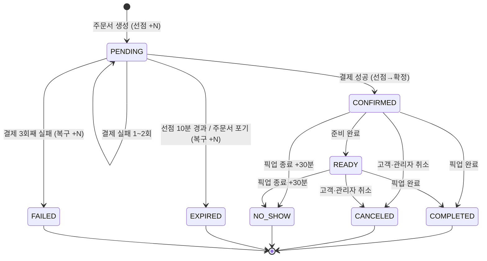
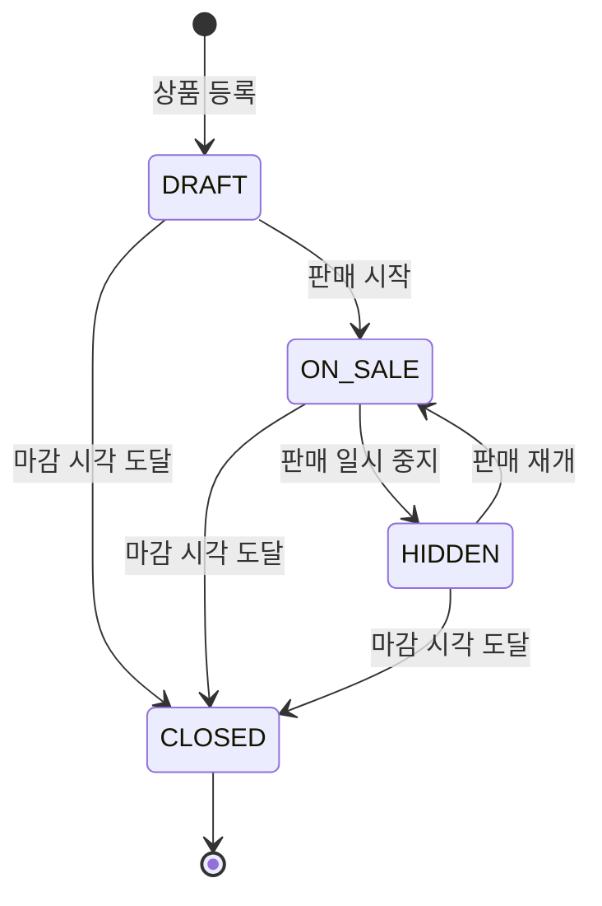

# savePick 데이터·상태 변화 규칙

- 문서 ID: 05
- 작성: product-planner
- 최종 갱신: 2026-08-28
- 선행 문서: 01, 02, 03, 04

## 한 줄 요약
주문·재고 선점·결제·상품·재고 수량·계정 제한의 상태값과 전이 조건을 전이표로 정의하고, 재고 선점부터 취소·복구까지의 수량 변화를 확정한다.

---

## 0. 공통 원칙

1. 상태값 이름은 영문 대문자 스네이크로 쓰고 모든 문서에서 같은 이름을 사용한다.
2. **각 전이표에 명시되지 않은 전이는 허용하지 않는다.** 정의되지 않은 전이 요청은 거부하고 현재 상태를 알린다.
3. `되돌릴 수 없음`으로 표시된 전이는 어떤 경로로도 역전이하지 않는다.
4. 모든 상태 전이는 시각과 실행 주체(고객 / 관리자 / 시스템)를 이력으로 남긴다.
5. 시각 판정 기준은 서버 시각(KST)이다 (BR-028).
6. 재고 수량이 변하는 전이는 상태 변경과 하나의 단위로 처리한다. 둘 중 하나만 반영된 상태는 허용하지 않는다.

---

## 1. 상태를 가지는 대상

| # | 대상 | 상태 개수 | 종료 상태 |
|---|---|---|---|
| 1 | 주문(ORDER) | 8 | COMPLETED, CANCELED, NO_SHOW, EXPIRED, FAILED |
| 2 | 재고 선점(RESERVATION) | 4 | CONSUMED, RELEASED, EXPIRED |
| 3 | 결제 시도(PAYMENT) | 3 | SUCCEEDED, FAILED |
| 4 | 상품(PRODUCT) | 4 | CLOSED |
| 5 | 재고 수량(STOCK) | 상태 없음, 4개 수량 값 | — |
| 6 | 계정 주문 권한(ORDER_PERMISSION) | 2 | — |

---

## 2. 주문 상태

### 2.1 상태값

| 상태 | 의미 | 재고 점유 형태 |
|---|---|---|
| PENDING | 주문서가 만들어졌고 결제 전이다 | 선점 중 |
| CONFIRMED | 결제가 성공해 주문이 확정됐다 | 확정 판매 |
| READY | 매장이 상품 준비를 마쳤다 | 확정 판매 |
| COMPLETED | 고객이 상품을 수령했다 | 확정 판매 |
| CANCELED | 고객 또는 관리자가 취소했다 | 없음 (복구 여부는 BR-019) |
| NO_SHOW | 픽업 유예까지 수령하지 않았다 | 확정 판매 (복구하지 않음) |
| EXPIRED | 선점 유효 시간이 끝나 주문서가 폐기됐다 | 없음 |
| FAILED | 결제가 3회 실패해 주문이 종료됐다 | 없음 |

### 2.2 전이표

| 현재 상태 | 이벤트 | 주체 | 다음 상태 | 재고 영향 | 규칙 | 되돌릴 수 없음 |
|---|---|---|---|---|---|---|
| (없음) | 주문서 생성 | 고객 | PENDING | 판매 가능 −N, 선점 중 +N | BR-007, BR-010, BR-027 | |
| PENDING | 결제 성공 | 고객 | CONFIRMED | 선점 중 −N, 확정 판매 +N | BR-011, BR-016, BR-026 | O |
| PENDING | 결제 실패 1~2회 | 고객 | PENDING (유지) | 변화 없음 | BR-012 | |
| PENDING | 결제 3회째 실패 | 고객 | FAILED | 선점 중 −N, 판매 가능 +N | BR-012 | O |
| PENDING | 선점 유효 시간 경과 | 시스템 | EXPIRED | 선점 중 −N, 판매 가능 +N | BR-007, BR-008 | O |
| PENDING | 고객이 주문서 포기 | 고객 | EXPIRED | 선점 중 −N, 판매 가능 +N | BR-008 | O |
| CONFIRMED | 준비 완료 처리 | 관리자 | READY | 변화 없음 | BR-020 | |
| CONFIRMED | 픽업 완료 처리 | 관리자 | COMPLETED | 변화 없음 | BR-020 | O |
| CONFIRMED | 고객 취소 (픽업 시작 1시간 전까지) | 고객 | CANCELED | 확정 판매 −N, 판매 가능 +N (마감 전) / 확정 판매 −N, 폐기 +N (마감 후) | BR-018, BR-019, BR-024 | O |
| CONFIRMED | 관리자 취소 (사유 필수) | 관리자 | CANCELED | 확정 판매 −N, 판매 가능 +N (마감 전) / 확정 판매 −N, 폐기 +N (마감 후) | BR-019, BR-020 | O |
| CONFIRMED | 픽업 종료 + 유예 30분 경과 | 시스템 | NO_SHOW | 변화 없음 (복구하지 않음) | BR-021, BR-022 | O |
| READY | 픽업 완료 처리 | 관리자 | COMPLETED | 변화 없음 | BR-020 | O |
| READY | 고객 취소 (픽업 시작 1시간 전까지) | 고객 | CANCELED | CONFIRMED 취소와 동일 | BR-018, BR-019 | O |
| READY | 관리자 취소 (사유 필수) | 관리자 | CANCELED | CONFIRMED 취소와 동일 | BR-019, BR-020 | O |
| READY | 픽업 종료 + 유예 30분 경과 | 시스템 | NO_SHOW | 변화 없음 (복구하지 않음) | BR-021, BR-022 | O |

`N`은 주문에 포함된 품목별 수량이며, 재고 영향은 품목마다 각각 적용한다.

### 2.3 허용하지 않는 전이 (명시)

| 시도 | 결과 |
|---|---|
| EXPIRED → PENDING | 거부한다. 다시 주문하려면 주문서를 새로 만든다 |
| FAILED → PENDING, FAILED → CONFIRMED | 거부한다 |
| COMPLETED → 다른 모든 상태 | 거부한다. 픽업 완료는 최종 상태다 |
| CANCELED → 다른 모든 상태 | 거부한다 |
| NO_SHOW → COMPLETED, NO_SHOW → CANCELED | 거부한다 |
| CONFIRMED → PENDING | 거부한다 |
| READY → CONFIRMED | 거부한다 |
| PENDING → COMPLETED | 거부한다. 결제 성공을 거치지 않은 수령은 없다 |
| PENDING → CANCELED | 거부한다. 결제 전 주문서 종료는 EXPIRED로 처리한다 |
| PENDING → NO_SHOW | 거부한다 |

### 2.4 전이 다이어그램

---

## 3. 재고 선점 상태

선점은 주문 1건의 품목 1개마다 하나씩 만들어진다.

### 3.1 상태값

| 상태 | 의미 |
|---|---|
| HELD | 재고를 잡고 있으며 유효 시간이 남아 있다 |
| CONSUMED | 결제 성공으로 확정 판매로 전환됐다 |
| RELEASED | 결제 최종 실패 또는 주문서 포기로 해제됐다 |
| EXPIRED | 유효 시간이 지나 자동 해제됐다 |

### 3.2 전이표

| 현재 상태 | 이벤트 | 주체 | 다음 상태 | 재고 수량 변화 | 규칙 | 되돌릴 수 없음 |
|---|---|---|---|---|---|---|
| (없음) | 주문서 생성 | 고객 | HELD | 판매 가능 −N, 선점 중 +N | BR-007, BR-027 | |
| HELD | 결제 성공 | 고객 | CONSUMED | 선점 중 −N, 확정 판매 +N | BR-011 | O |
| HELD | 결제 3회째 실패 | 고객 | RELEASED | 선점 중 −N, 판매 가능 +N | BR-012 | O |
| HELD | 주문서 포기 | 고객 | RELEASED | 선점 중 −N, 판매 가능 +N | BR-008 | O |
| HELD | 생성 후 10분 경과 | 시스템 | EXPIRED | 선점 중 −N, 판매 가능 +N | BR-007, BR-008 | O |

### 3.3 허용하지 않는 전이 (명시)

| 시도 | 결과 |
|---|---|
| EXPIRED → HELD, RELEASED → HELD | 거부한다. 선점은 연장·복원되지 않는다 |
| CONSUMED → HELD, CONSUMED → RELEASED | 거부한다. 확정 이후 재고 반환은 주문 취소(BR-019)로만 처리한다 |
| HELD 유효 시간 연장 | 허용하지 않는다 (BR-007) |

### 3.4 판정 규칙

| # | 규칙 |
|---|---|
| 1 | 만료 판정은 결제 요청 시점 검사와 1분 이내 주기 정리 두 경로에서 모두 이뤄진다 (BR-008) |
| 2 | 만료 시각이 지난 HELD 선점은 정리 작업 전이라도 잔여 수량 계산에서 제외한다 |
| 3 | 하나의 주문서에 속한 선점은 전부 성공하거나 전부 만들어지지 않는다 (BR-027) |
| 4 | 하나의 주문서에 속한 선점은 같은 만료 시각을 가진다 |

---

## 4. 결제 시도 상태

결제는 주문 1건에 대해 최대 3개의 시도 기록을 가진다.

### 4.1 상태값

| 상태 | 의미 |
|---|---|
| REQUESTED | 결제를 요청했고 결과를 기다린다 |
| SUCCEEDED | 성공 결과를 받았다 |
| FAILED | 실패 결과를 받았거나 응답이 없었다 |

### 4.2 전이표

| 현재 상태 | 이벤트 | 주체 | 다음 상태 | 주문 영향 | 규칙 | 되돌릴 수 없음 |
|---|---|---|---|---|---|---|
| (없음) | 결제 요청 | 고객 | REQUESTED | 변화 없음 | BR-011, BR-029 | |
| REQUESTED | 성공 응답 | 시스템 | SUCCEEDED | 주문 PENDING → CONFIRMED | BR-011 | O |
| REQUESTED | 실패 응답 | 시스템 | FAILED | 시도 횟수 3회 미만이면 주문 PENDING 유지 | BR-012 | O |
| REQUESTED | 응답 없음 | 시스템 | FAILED | 실패와 동일하게 처리하고 시도 횟수를 1회 차감한다 | BR-011, BR-012 | O |

### 4.3 시도 횟수 규칙

| # | 규칙 |
|---|---|
| 1 | 같은 주문서의 결제 시도는 최대 3회다 (BR-012) |
| 2 | 3회째 시도가 FAILED가 되면 주문은 FAILED, 선점은 RELEASED가 된다 |
| 3 | 하나의 주문에 SUCCEEDED 기록은 최대 1개다 |
| 4 | SUCCEEDED가 생긴 뒤에는 추가 결제 요청을 받지 않는다 |
| 5 | 선점이 EXPIRED가 되면 시도 횟수가 남아 있어도 결제를 요청할 수 없다 (BR-012) |
| 6 | 결제 요청 금액이 주문서 확정 금액과 다르면 REQUESTED를 만들지 않는다 (BR-029) |

### 4.4 허용하지 않는 전이 (명시)

| 시도 | 결과 |
|---|---|
| SUCCEEDED → FAILED, FAILED → SUCCEEDED | 거부한다. 시도 기록은 확정 후 변경하지 않는다 |
| 4회째 REQUESTED 생성 | 거부한다 |

---

## 5. 상품 상태

### 5.1 상태값

| 상태 | 의미 | 고객 노출 | 신규 주문 |
|---|---|---|---|
| DRAFT | 등록했으나 아직 판매하지 않는다 | 안 됨 | 불가 |
| ON_SALE | 판매 중이다 | 됨 | 가능 |
| HIDDEN | 일시적으로 판매를 멈췄다 | 안 됨 | 불가 |
| CLOSED | 마감 시각이 지나 판매가 끝났다 | 안 됨 | 불가 |

### 5.2 전이표

| 현재 상태 | 이벤트 | 주체 | 다음 상태 | 기존 주문 영향 | 규칙 | 되돌릴 수 없음 |
|---|---|---|---|---|---|---|
| (없음) | 상품 등록 | 관리자 | DRAFT | — | BR-003 | |
| DRAFT | 판매 시작 (재고 1 이상 등록 상태) | 관리자 | ON_SALE | — | BR-004, BR-030 | |
| ON_SALE | 판매 일시 중지 | 관리자 | HIDDEN | 기존 HELD 선점과 확정 주문을 유지한다 | BR-025, BR-030 | |
| HIDDEN | 판매 재개 | 관리자 | ON_SALE | — | BR-030 | |
| ON_SALE | 마감 시각 도달 | 시스템 | CLOSED | 기존 HELD 선점은 만료 시각까지 유효, 확정 주문은 유지 | BR-030 | O |
| HIDDEN | 마감 시각 도달 | 시스템 | CLOSED | 동일 | BR-030 | O |
| DRAFT | 마감 시각 도달 | 시스템 | CLOSED | — | BR-030 | O |

### 5.3 허용하지 않는 전이 (명시)

| 시도 | 결과 |
|---|---|
| CLOSED → ON_SALE, CLOSED → HIDDEN, CLOSED → DRAFT | 거부한다. 마감된 상품은 되살리지 않고 새 상품으로 등록한다 |
| ON_SALE → DRAFT | 거부한다. 판매를 멈추려면 HIDDEN을 쓴다 |
| 재고가 등록되지 않은 DRAFT → ON_SALE | 거부한다 |
| CLOSED 상품의 마감 시각 수정 | 거부한다 |

### 5.4 전이 다이어그램

---

## 6. 재고 수량 변화 규칙

### 6.1 수량 값

상품마다 아래 값을 유지한다 (BR-006).

| 값 | 정의 | 불변 조건 |
|---|---|---|
| `총 재고` | 관리자가 등록한 실물 수량 | 0 이상 |
| `선점 중` | HELD 상태 선점 수량의 합 | 0 이상 |
| `확정 판매` | CONFIRMED·READY·COMPLETED·NO_SHOW 주문 수량의 합 | 0 이상 |
| `판매 가능` | 총 재고 − 선점 중 − 확정 판매 | 0 이상 |

항상 `총 재고 = 판매 가능 + 선점 중 + 확정 판매`가 성립한다.

### 6.2 이벤트별 수량 변화표

| # | 이벤트 | 총 재고 | 판매 가능 | 선점 중 | 확정 판매 | 규칙 |
|---|---|---|---|---|---|---|
| S1 | 관리자 재고 등록·증가 (+M) | +M | +M | 0 | 0 | BR-006 |
| S2 | 관리자 재고 축소 (−M) | −M | −M | 0 | 0 | BR-025 |
| S3 | 주문서 생성 (선점 N) | 0 | −N | +N | 0 | BR-007 |
| S4 | 결제 성공 (확정 N) | 0 | 0 | −N | +N | BR-011 |
| S5 | 결제 3회째 실패 | 0 | +N | −N | 0 | BR-012 |
| S6 | 선점 만료 | 0 | +N | −N | 0 | BR-007 |
| S7 | 주문 취소 (상품 마감 전) | 0 | +N | 0 | −N | BR-019 |
| S8 | 주문 취소 (상품 마감 후) | −N | 0 | 0 | −N | BR-019 |
| S9 | 픽업 완료 | 0 | 0 | 0 | 0 | — |
| S10 | 노쇼 전환 | 0 | 0 | 0 | 0 | BR-022 |

- S2는 `−M` 적용 후 `판매 가능 ≥ 0`을 만족할 때만 실행한다. 만족하지 못하면 거부한다 (BR-025).
- S8은 팔 수 없게 된 수량을 총 재고에서 덜어내는 처리이며, 폐기 수량으로 이력에 남긴다.
- S9, S10은 수량이 변하지 않으며 상태만 바뀐다. 노쇼 수량은 확정 판매로 남는다.

### 6.3 수량 변화 예시

총 재고 10개인 상품의 시간순 변화다.

| 시각 | 이벤트 | 총 재고 | 판매 가능 | 선점 중 | 확정 판매 |
|---|---|---|---|---|---|
| 10:00 | 관리자 재고 10개 등록 (S1) | 10 | 10 | 0 | 0 |
| 12:00 | 고객 A가 3개 주문서 생성 (S3) | 10 | 7 | 3 | 0 |
| 12:02 | 고객 B가 2개 주문서 생성 (S3) | 10 | 5 | 5 | 0 |
| 12:03 | 고객 A 결제 성공 (S4) | 10 | 5 | 2 | 3 |
| 12:12 | 고객 B 선점 만료 (S6) | 10 | 7 | 0 | 3 |
| 15:00 | 고객 A 취소, 상품 마감 전 (S7) | 10 | 10 | 0 | 0 |
| 18:00 | 고객 C가 4개 주문 후 결제 성공 (S3+S4) | 10 | 6 | 0 | 4 |
| 21:00 | 상품 마감 시각 도달, 상품 CLOSED | 10 | 6 | 0 | 4 |
| 21:10 | 고객 C 주문을 관리자가 취소, 마감 후 (S8) | 6 | 6 | 0 | 0 |

### 6.4 정합성 규칙

| # | 규칙 | 위반 시 처리 |
|---|---|---|
| C1 | `총 재고 = 판매 가능 + 선점 중 + 확정 판매` | 연산을 실행하지 않고 거부한다 |
| C2 | 모든 수량 값은 0 이상이다 | 음수가 되는 연산을 거부한다 |
| C3 | 확정 판매 수량의 합은 총 재고를 초과하지 않는다 | 초과가 발생하는 결제 성공 처리를 거부한다 |
| C4 | 하나의 상태 전이에서 수량 변화와 상태 변경은 함께 반영된다 | 둘 중 하나만 반영된 결과를 남기지 않는다 |
| C5 | 만료 시각이 지난 HELD 선점은 정리 전이라도 `선점 중`에서 제외해 계산한다 | 판매 가능 수량이 실제보다 적게 표시되지 않게 한다 |

---

## 7. 계정 주문 권한 상태

### 7.1 상태값

| 상태 | 의미 |
|---|---|
| ALLOWED | 주문서를 만들 수 있다 |
| RESTRICTED | 노쇼 누적으로 주문서를 만들 수 없다 |

### 7.2 전이표

| 현재 상태 | 이벤트 | 주체 | 다음 상태 | 영향 | 규칙 |
|---|---|---|---|---|---|
| (없음) | 회원가입 | 고객 | ALLOWED | — | BR-002 |
| ALLOWED | 최근 30일 노쇼 3회 도달 | 시스템 | RESTRICTED | 신규 주문서 생성 차단, 기존 확정 주문은 유지 | BR-023 |
| RESTRICTED | 제한 시작 후 7일 경과 | 시스템 | ALLOWED | 별도 절차 없이 주문 가능 | BR-023 |

### 7.3 허용하지 않는 전이 (명시)

| 시도 | 결과 |
|---|---|
| RESTRICTED 상태에서 주문서 생성 | 거부하고 해제 예정 시각을 알린다 |
| RESTRICTED 상태에서 기존 확정 주문 자동 취소 | 실행하지 않는다 |
| 관리자의 제한 즉시 해제 | 첫 버전에서는 제공하지 않는다 |

### 7.4 제한 중에도 가능한 동작

| 동작 | 가능 여부 |
|---|---|
| 로그인 | 가능 |
| 상품 목록·검색·상세 조회 | 가능 |
| 장바구니 담기·수정 | 가능 |
| 주문 내역·상세 조회 | 가능 |
| 기존 확정 주문 취소 | 가능 |
| 주문서 생성 | 불가 |

---

## 8. 픽업 시간대 정원 변화

정원은 상태가 아니라 카운터이며 주문 상태 전이에 따라 변한다.

| 주문 전이 | 정원 점유 | 규칙 |
|---|---|---|
| PENDING → CONFIRMED | +1 | BR-016 |
| CONFIRMED / READY → CANCELED | −1 (반납) | BR-016, BR-019 |
| CONFIRMED / READY → COMPLETED | 변화 없음 | BR-016 |
| CONFIRMED / READY → NO_SHOW | −1 (반납하되 이미 시각이 지나 재판매되지 않음) | BR-016, BR-022 |
| PENDING → EXPIRED / FAILED | 변화 없음 (점유한 적 없음) | BR-016 |

- PENDING 주문은 픽업 시간대 정원을 점유하지 않는다. 정원 판정은 결제 성공 직전에 다시 수행한다 (BR-016).
- 관리자가 정원을 줄여 기존 점유 건수가 새 정원을 넘겨도 기존 주문은 그대로 둔다 (BR-016).

---

## 9. 상태별 가능한 동작 요약

| 주문 상태 | 고객 취소 | 관리자 취소 | 준비 완료 | 픽업 완료 | 결제 요청 |
|---|---|---|---|---|---|
| PENDING | 불가 | 불가 | 불가 | 불가 | 가능 (3회 한도) |
| CONFIRMED | 픽업 1시간 전까지 가능 | 가능 | 가능 | 가능 | 불가 |
| READY | 픽업 1시간 전까지 가능 | 가능 | 불가 | 가능 | 불가 |
| COMPLETED | 불가 | 불가 | 불가 | 불가 | 불가 |
| CANCELED | 불가 | 불가 | 불가 | 불가 | 불가 |
| NO_SHOW | 불가 | 불가 | 불가 | 불가 | 불가 |
| EXPIRED | 불가 | 불가 | 불가 | 불가 | 불가 |
| FAILED | 불가 | 불가 | 불가 | 불가 | 불가 |

---

## 가정 / 미확정

### 가정 (확인 필요)

| # | 가정한 내용 | 근거 | 틀릴 경우 영향 |
|---|---|---|---|
| A1 | 주문 상태를 8개(PENDING, CONFIRMED, READY, COMPLETED, CANCELED, NO_SHOW, EXPIRED, FAILED)로 나눈다 | 결제 실패(FAILED)와 선점 만료(EXPIRED)는 원인과 재시도 가능성이 달라 구분해야 운영 분석이 가능하다 | 상태 수가 줄면 전이표와 주문 조회 필터가 바뀐다 |
| A2 | READY는 선택 경유 상태이며 CONFIRMED에서 바로 COMPLETED로 갈 수 있다 | 소규모 매장에서 단계 강제는 운영 부담이 된다 | READY가 필수 경유가 되면 CONFIRMED → COMPLETED 전이를 제거해야 한다 |
| A3 | 고객이 결제 전 주문서를 포기하면 EXPIRED로 처리한다 | PENDING 취소를 CANCELED로 두면 취소 통계에 결제 전 이탈이 섞인다 | 상태 이름과 지표 M5, M7 산식이 바뀐다 |
| A4 | 선점은 주문 품목마다 1건씩 만들고 같은 만료 시각을 공유한다 | 품목별 부분 만료가 생기면 주문 금액과 내용이 어긋난다 | 선점 단위와 만료 처리 방식이 바뀐다 |
| A5 | 결제 무응답을 실패로 간주하고 시도 횟수를 차감한다 | 무응답을 성공으로 볼 수 없고 횟수를 차감하지 않으면 무한 재시도가 가능해진다 | 결제 시도 규칙과 재시도 한도 효과가 바뀐다 |
| A6 | 노쇼 수량은 확정 판매로 남기고 총 재고에서 덜어내지 않는다 | 노쇼는 판매가 성립한 상태이며 매출·폐기 집계 기준이 취소와 다르다 | 재고 집계와 지표 M1 산식이 바뀐다 |
| A7 | 마감 후 취소분(S8)은 총 재고에서 차감해 폐기로 기록한다 | 팔 수 없는 수량을 재고로 남기면 재고 현황이 실물과 어긋난다 | 재고 정합성 규칙 C1과 폐기 집계가 바뀐다 |
| A8 | 상품 상태를 4개(DRAFT, ON_SALE, HIDDEN, CLOSED)로 나눈다 | 등록 준비와 일시 중지를 구분해야 관리자가 실수로 노출하는 일을 막는다 | 상품 관리 요구사항 FR-042가 바뀐다 |
| A9 | CLOSED는 되돌릴 수 없고 재판매하려면 새 상품으로 등록한다 | 마감 시각이 상품 정체성의 일부다 | 상품 재사용 요구사항이 추가된다 |
| A10 | 픽업 시간대 정원은 PENDING 단계에서 점유하지 않는다 | 결제 전 이탈이 많은데 정원을 잡으면 시간대가 헛되게 막힌다 | 결제 직전 정원 재검증이 불필요해지는 대신 정원 초과 위험이 생긴다 |
| A11 | 관리자의 노쇼 제한 즉시 해제 기능을 첫 버전에 넣지 않는다 | 예외 처리 경로가 늘면 제재 규칙이 무력화된다 | 관리자 기능에 제한 해제 요구사항이 추가된다 |

### 미확정 (결정 대기)

| # | 결정이 필요한 사항 | 선택지 | 막히는 작업 |
|---|---|---|---|
| U1 | READY 상태의 첫 버전 포함 여부 | 선택 경유로 포함 (임시 채택) / 상태 자체를 두지 않음 | 주문 상태 전이표, FR-051 |
| U2 | 결제 전 주문서 포기의 상태 이름 | EXPIRED로 통합 (임시 채택) / ABANDONED 신설 | 상태 전이표, 지표 M5 산식 |
| U3 | 노쇼 주문의 재고 집계 처리 | 확정 판매로 유지 (임시 채택) / 별도 폐기 값으로 이동 | 재고 현황 표시, 지표 M1 |
| U4 | 마감 후 취소분의 총 재고 차감 여부 | 차감하고 폐기 기록 (임시 채택) / 총 재고 유지하고 별도 폐기 값 관리 | 재고 정합성 규칙, 재고 이력 |
| U5 | 픽업 정원 점유 시점 | 결제 성공 시 (임시 채택) / 주문서 생성 시 | 정원 판정, 결제 직전 재검증 필요 여부 |
| U6 | 관리자의 노쇼 제한 즉시 해제 기능 | 제공하지 않음 (임시 채택) / 사유 입력 후 해제 허용 | 관리자 기능 범위 |

### 향후 검토 (첫 버전 범위 밖)

| # | 내용 | 사유 |
|---|---|---|
| F1 | 실제 환불 상태(REFUND_REQUESTED, REFUNDED) 추가 | 제외 범위(실제 결제) |
| F2 | 배송 관련 상태(배차, 배송 중, 배송 완료) 추가 | 제외 범위(배송·라이더) |
| F3 | 매장 간 재고 이동 상태 | 제외 범위(다중 매장) |
| F4 | 픽업 도착 감지에 따른 자동 상태 전환 | 제외 범위(지도·위치) |
