# savePick 사용자 흐름

- 문서 ID: 07
- 작성: experience-designer
- 최종 갱신: 2026-08-28
- 선행 문서: 01, 02, 03, 04, 05, 06

## 한 줄 요약
고객 흐름 6개와 관리자 흐름 5개를 화면 ID가 붙은 Mermaid 다이어그램으로 분리해 정의하고, 각 흐름의 시작·종료 조건과 예외 경로를 명시한다.

---

## 0. 읽는 방법

- 흐름 ID는 고객 `FL-001~FL-006`, 관리자 `FL-101~FL-105`로 부여한다.
- 노드에는 `06-screen-list.md`의 화면 ID를 함께 적는다.
- 정상 경로는 실선(`-->`), 예외·타임아웃 경로는 점선(`-.->`)으로 그린다.
- 분기 노드에는 판정 조건을 적는다. 판정 기준 시각은 모두 서버 시각(KST)이다 (BR-028).
- **고객 흐름과 관리자 흐름은 별도 다이어그램으로 그리며 한 그림에 합치지 않는다.** 두 흐름의 접점은 6장에서 상태 변화로만 서술한다.

### 0.1 흐름 목록

| ID | 흐름 | 사용자 | 시작 조건 | 종료 조건 |
|---|---|---|---|---|
| FL-001 | 상품 탐색부터 주문 확정까지 | 고객, 비로그인 | 서비스에 진입한다 | 주문이 CONFIRMED가 되고 픽업 번호를 받는다 |
| FL-002 | 비로그인 주문 시도와 로그인 복귀 | 비로그인 | 미로그인 상태로 장바구니에서 주문하기를 누른다 | 로그인·가입 후 장바구니를 유지한 채 주문서 생성으로 돌아온다 |
| FL-003 | 선점 만료 예외 | 고객 | 주문서(PENDING)의 선점 유효 시간 10분이 끝난다 | 주문이 EXPIRED가 되고 고객이 장바구니에서 다시 시작한다 |
| FL-004 | 가상 결제 실패와 재시도 | 고객 | 결제 요청이 실패 결과를 반환한다 | 재시도로 CONFIRMED가 되거나 3회째 실패로 FAILED가 된다 |
| FL-005 | 주문 취소 | 고객 | 확정된 주문의 상세를 연다 | 주문이 CANCELED가 되거나 취소 불가 사유를 확인한다 |
| FL-006 | 노쇼 결과 확인과 주문 제한 | 고객 | 주문이 시스템에 의해 NO_SHOW로 전환된다 | 고객이 노쇼 결과와 제한 해제 예정 시각을 확인한다 |
| FL-101 | 개점 · 상품과 재고 등록 | 관리자 | 관리자가 관리자 진입 주소로 로그인한다 | 상품이 ON_SALE이 되어 고객 목록에 노출된다 |
| FL-102 | 픽업 준비와 수령 처리 | 관리자 | 픽업 시간대가 임박해 픽업 현황을 연다 | 주문이 COMPLETED가 된다 |
| FL-103 | 관리자 주문 취소 | 관리자 | 운영 사유로 확정 주문을 취소해야 한다 | 사유가 기록된 채 주문이 CANCELED가 된다 |
| FL-104 | 노쇼 정리 확인 | 관리자 | 마감 정리 시각에 미수령 주문을 확인한다 | 노쇼 전환 결과를 확인하고 유예 내 주문은 완료 처리한다 |
| FL-105 | 픽업 운영 설정 변경 | 관리자 | 운영 조건을 조정해야 한다 | 변경이 이후 생성되는 주문부터 적용된다 |

---

## 1. 고객 흐름

### 1.1 고객 전체 흐름도

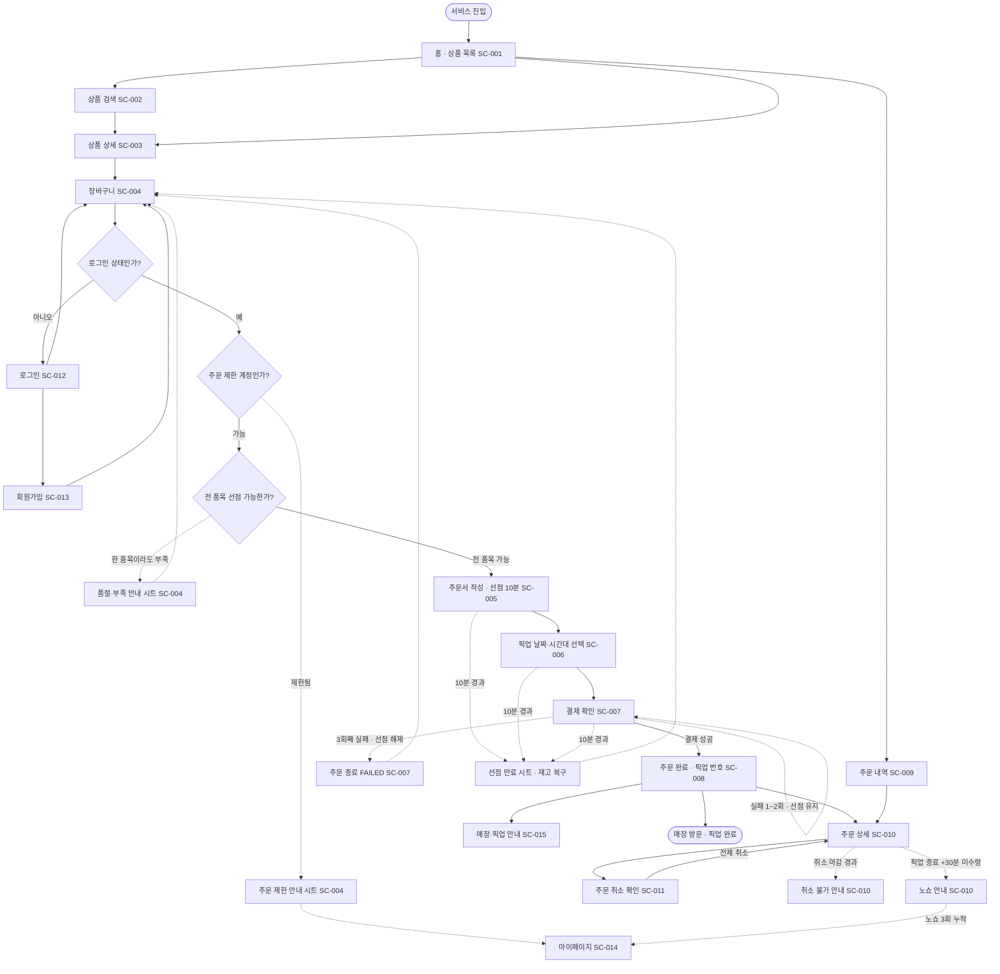

---

### FL-001 · 상품 탐색부터 주문 확정까지

- 사용자: 고객, 비로그인(탐색·담기까지)
- 시작 조건: 고객이 서비스에 진입한다
- 종료 조건: 주문이 CONFIRMED가 되고 픽업 번호가 발급된다
- 관련 시나리오: CS-01

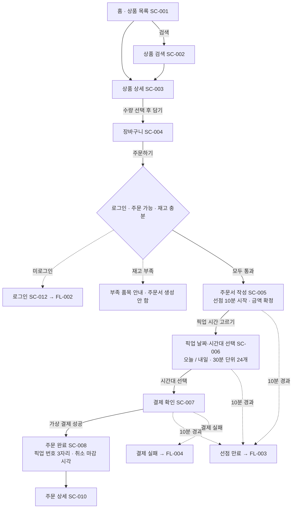

**단계별 화면 전이와 상태 변화**

| # | 화면 | 고객 액션 | 주문 상태 | 재고 변화 |
|---|---|---|---|---|
| 1 | SC-001 → SC-003 | 상품 선택 | — | 없음 |
| 2 | SC-003 → SC-004 | 장바구니 담기 | — | 없음 (BR-010) |
| 3 | SC-004 → SC-005 | 주문하기 | (없음) → PENDING | 판매 가능 −N, 선점 중 +N |
| 4 | SC-005 → SC-006 | 픽업 시간 고르기 | PENDING 유지 | 없음 |
| 5 | SC-006 → SC-007 | 시간대 선택 후 결제로 | PENDING 유지 | 없음 |
| 6 | SC-007 → SC-008 | 결제 성공 | PENDING → CONFIRMED | 선점 중 −N, 확정 판매 +N, 정원 +1 |

**분기 조건**

| 분기 | 조건 | 통과 못 하면 |
|---|---|---|
| 로그인 | 인증 상태 | SC-012로 이동 (FL-002) |
| 주문 권한 | 계정이 ALLOWED | SC-004에 제한 안내 시트, 해제 예정 시각 표시 |
| 진행 중 주문서 | 유효한 PENDING 주문서 없음 | `주문서로 이동` 안내 |
| 재고 | 전 품목 잔여 수량 ≥ 담긴 수량 | 부족 품목·수량 안내, 부분 선점 만들지 않음 |
| 픽업 시간대 | 선택 가능한 시간대 1개 이상 | SC-006 전체 빈 상태, 주문 진행 불가 |
| 금액 일치 | 결제 요청 금액 = 주문서 확정 금액 | 결제 진행 안 함, 주문서 재확인 안내 |

---

### FL-002 · 비로그인 주문 시도와 로그인 복귀

- 사용자: 비로그인
- 시작 조건: 미로그인 상태로 SC-004에서 `주문하기`를 누른다
- 종료 조건: 로그인 또는 가입을 마치고 장바구니 내용이 유지된 채 SC-004로 돌아온다
- 관련 시나리오: CS-01 6~8단계

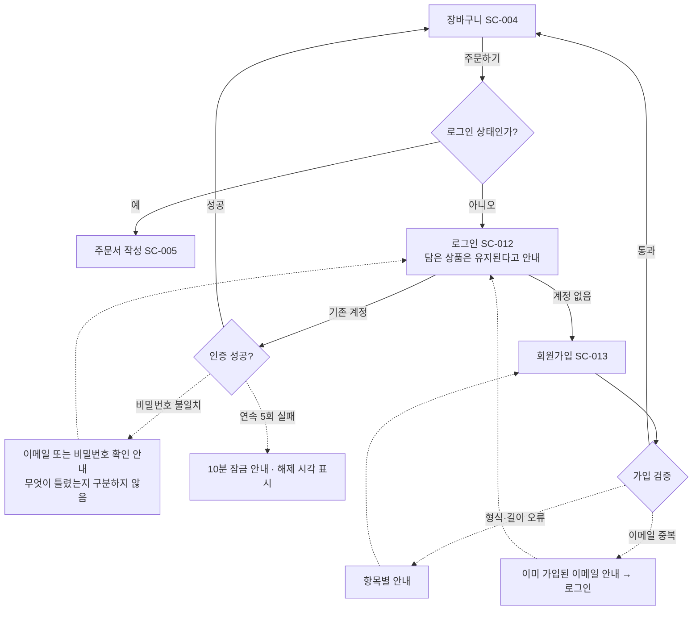

**규칙 반영**
- 가입 완료 시 별도 로그인 없이 인증 상태가 된다 (FR-001).
- 미로그인 장바구니는 로그인 후에도 그대로 유지된다.
- 가입만으로 관리자 권한은 부여되지 않으며 관리자 화면에 도달할 수 없다 (FR-004).

---

### FL-003 · 선점 만료 예외

- 사용자: 고객
- 시작 조건: PENDING 주문서 생성 후 10분이 지난다 (연장 없음)
- 종료 조건: 주문이 EXPIRED가 되고 선점 수량이 판매 가능 재고로 복구된다
- 관련 시나리오: CS-02

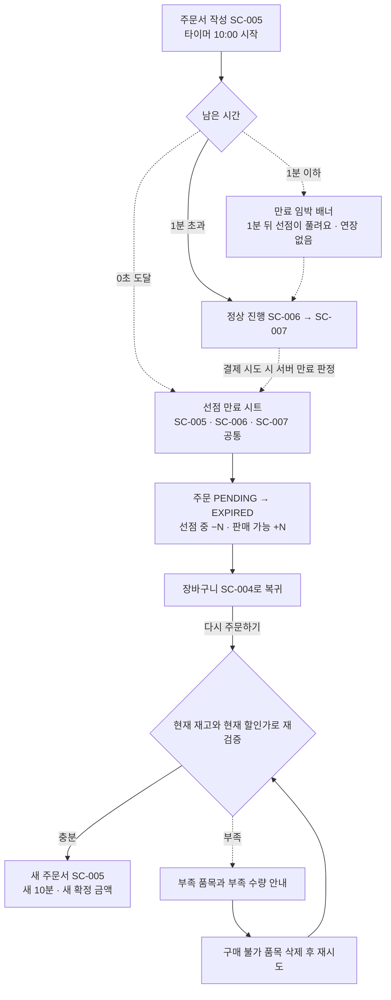

**화면별 만료 표현**

| 화면 | 만료 전 | 만료 시점 |
|---|---|---|
| SC-005 | 상단 고정 타이머 `mm:ss`, 1분 이하 시 경고색 | 화면을 덮는 만료 시트, 뒤로가기로 주문서 복귀 불가 |
| SC-006 | 상단 고정 타이머 유지 | 동일 시트. 선택하던 시간대는 유지하지 않는다 |
| SC-007 | 결제 버튼 위 남은 시간 표시 | 결제 요청을 보내지 않고 만료 시트로 전환 |

**규칙 반영**
- EXPIRED에서 PENDING으로 되돌아가지 않는다 (05-state-rules 2.3).
- 만료된 수량은 만료 시점에 이미 다른 고객의 잔여 수량으로 반영된다 (BR-008).
- 재시도 횟수가 남아 있어도 만료 후에는 결제할 수 없다 (BR-012).

---

### FL-004 · 가상 결제 실패와 재시도

- 사용자: 고객
- 시작 조건: SC-007에서 결제 요청이 실패 결과 또는 무응답을 반환한다
- 종료 조건: 재시도로 CONFIRMED가 되거나 3회째 실패로 FAILED가 되고 선점이 즉시 해제된다
- 관련 시나리오: CS-03

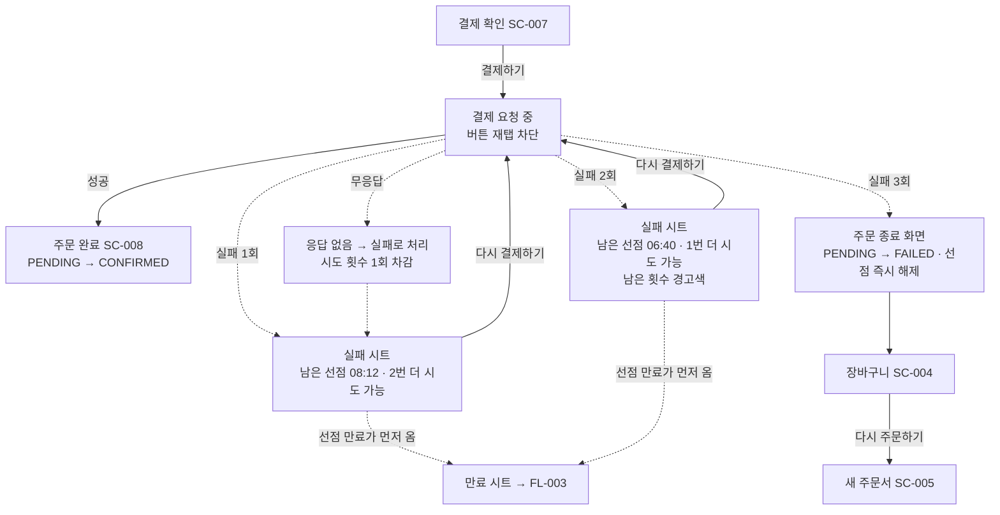

**재시도 안내에 반드시 표시하는 값**

| 시도 | 안내 문구 | 남은 재시도 |
|---|---|---|
| 1회 실패 | `결제가 완료되지 않았어요. 선점은 08:12 남았고 2번 더 시도할 수 있어요` | 2 |
| 2회 실패 | `1번 더 시도할 수 있어요` (경고색) | 1 |
| 3회 실패 | `주문이 종료됐어요. 선점한 수량은 다시 판매 가능해졌어요` | 0 |

**규칙 반영**
- 재고 복구 시점은 `3회째 실패`와 `선점 만료` 중 먼저 오는 시점이다 (BR-012).
- FAILED 주문에는 픽업 번호를 발급하지 않는다 (FR-025).
- 하나의 주문에 성공 기록은 최대 1개이며 성공 이후 추가 결제 요청을 받지 않는다.

---

### FL-005 · 주문 취소

- 사용자: 고객
- 시작 조건: CONFIRMED 또는 READY 주문의 상세(SC-010)를 연다
- 종료 조건: 주문이 CANCELED가 되거나 취소 불가 사유를 확인한다
- 관련 시나리오: CS-05, CS-06

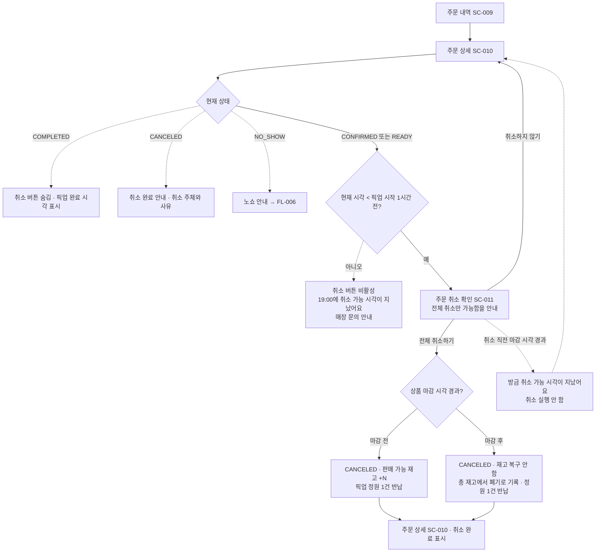

**규칙 반영**
- 부분 취소는 없다. 항상 주문 전체가 취소된다 (BR-024).
- 픽업 시간대 정원은 취소 시점과 무관하게 항상 1건 반납한다 (BR-019).
- 여러 품목 중 일부만 마감 시각이 지난 경우 마감 전 품목만 복구한다.

---

### FL-006 · 노쇼 결과 확인과 주문 제한

- 사용자: 고객
- 시작 조건: 픽업 시간대 종료 후 30분 유예가 지난 시점에 주문이 CONFIRMED 또는 READY 상태다
- 종료 조건: 고객이 NO_SHOW 결과와 누적 횟수, 제한 해제 예정 시각을 확인한다
- 관련 시나리오: CS-07

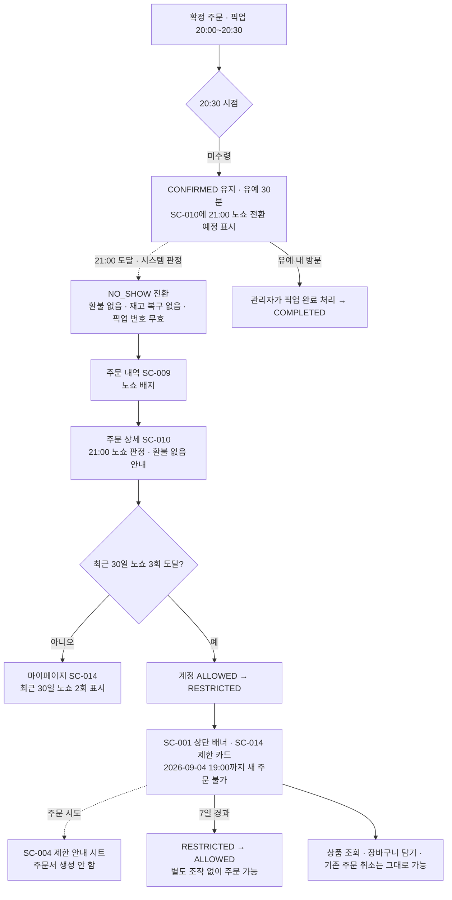

**규칙 반영**
- 노쇼 수량은 확정 판매로 남고 잔여 수량으로 복구되지 않는다 (BR-022).
- 제한 상태에서도 로그인, 조회, 담기, 기존 확정 주문 취소는 가능하다 (05-state-rules 7.4).
- 관리자가 제한을 즉시 해제하는 기능은 첫 버전에 없다.

---

## 2. 관리자 흐름

### 2.1 관리자 전체 흐름도

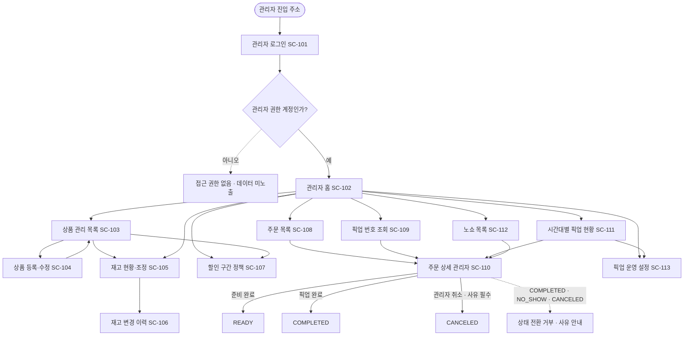

---

### FL-101 · 개점 · 상품과 재고 등록

- 사용자: 관리자
- 시작 조건: 관리자가 관리자 진입 주소로 로그인한다
- 종료 조건: 상품이 ON_SALE이 되어 고객 목록에 노출되고 할인율이 자동 적용된다
- 관련 시나리오: AS-01, AS-02

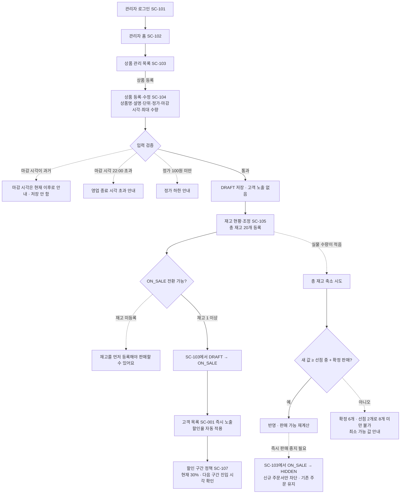

**규칙 반영**
- 등록 직후 상태는 DRAFT이며 고객에게 노출되지 않는다 (FR-040).
- 재고 축소로 이미 만들어진 선점·확정 주문이 취소되지 않는다 (BR-025).
- HIDDEN 전환은 기존 PENDING 선점과 CONFIRMED 주문을 유지한다 (FR-042).
- 마감 시각 도달 시 관리자 조작 없이 CLOSED가 되고 되돌릴 수 없다.

---

### FL-102 · 픽업 준비와 수령 처리

- 사용자: 관리자
- 시작 조건: 픽업 시간대가 임박해 SC-111 픽업 현황을 연다
- 종료 조건: 주문이 COMPLETED가 되며 재고 수량은 변하지 않는다
- 관련 시나리오: AS-03

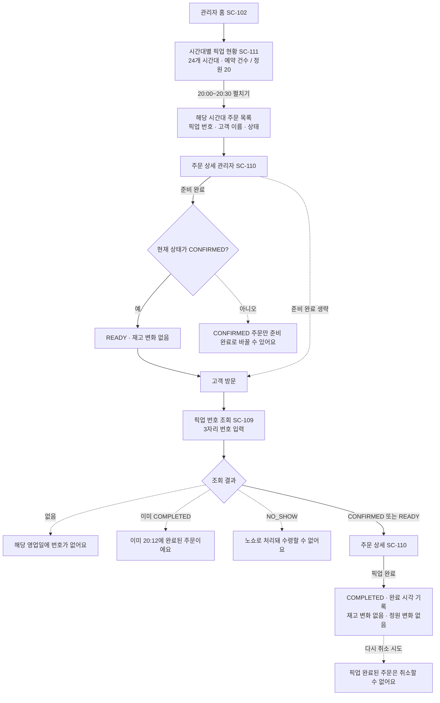

**규칙 반영**
- READY는 선택 단계이며 CONFIRMED에서 바로 COMPLETED로 갈 수 있다 (FR-051).
- 노쇼 유예가 끝나기 전이면 픽업 시간대가 지난 주문도 완료 처리할 수 있다 (FR-052).
- 같은 주문을 두 번 완료 처리할 수 없다.

---

### FL-103 · 관리자 주문 취소

- 사용자: 관리자
- 시작 조건: 운영 사유로 CONFIRMED 또는 READY 주문을 취소해야 한다
- 종료 조건: 사유가 기록된 채 주문이 CANCELED가 되고 재고 복구 여부가 이력에 남는다
- 관련 시나리오: AS-05, CS-06 3단계

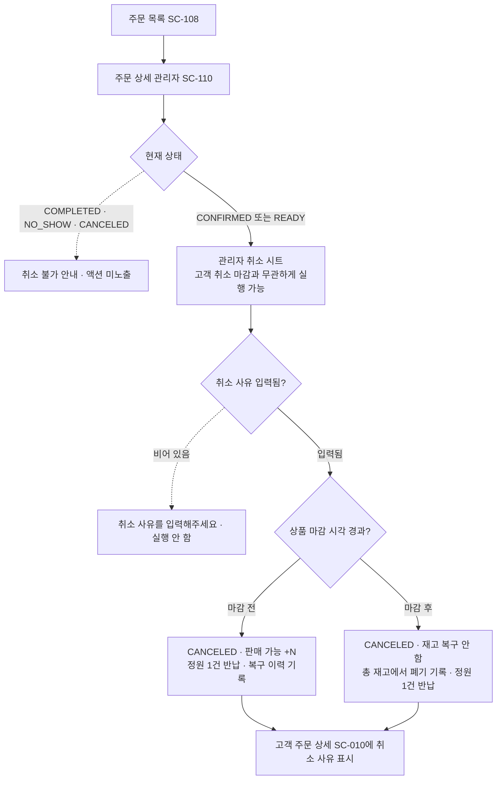

**규칙 반영**
- 취소 사유 입력은 필수다 (BR-020).
- 부분 취소는 지원하지 않는다 (BR-024).
- 재고 복구 여부와 그 사유가 재고 변경 이력(SC-106)에 남는다 (FR-047).

---

### FL-104 · 노쇼 정리 확인

- 사용자: 관리자
- 시작 조건: 마감 정리 시각에 미수령 주문을 확인한다
- 종료 조건: 자동 전환 결과를 확인하고, 유예가 남은 주문은 필요 시 완료 처리한다
- 관련 시나리오: AS-04

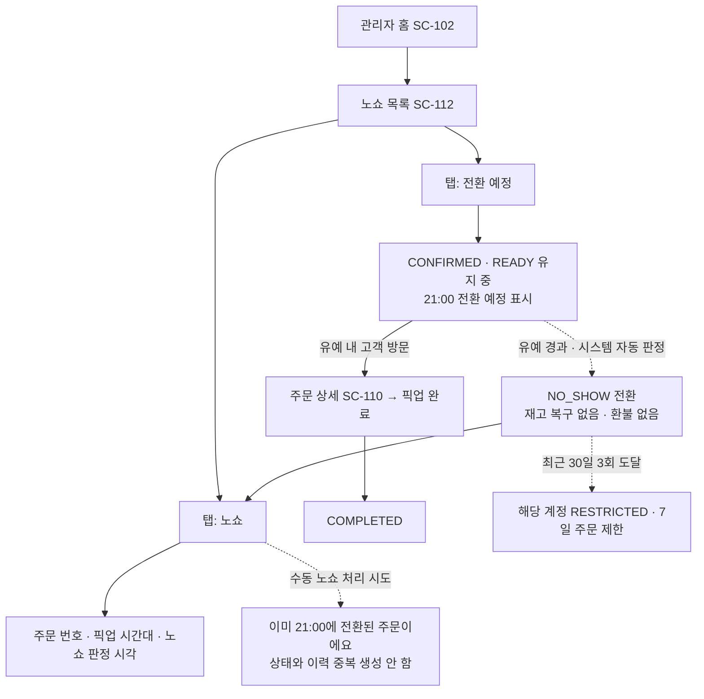

**규칙 반영**
- 노쇼 전환에 관리자 조작이 필요하지 않다 (FR-053).
- 노쇼 수량의 실물 폐기는 서비스 밖 행위이며 화면에서 재고 복구를 제공하지 않는다.

---

### FL-105 · 픽업 운영 설정 변경

- 사용자: 관리자
- 시작 조건: 영업시간·정원·차단 시간대를 조정해야 한다
- 종료 조건: 변경이 이후 생성되는 주문부터 적용되고 확정 주문은 그대로 유지된다
- 관련 시나리오: AS-06

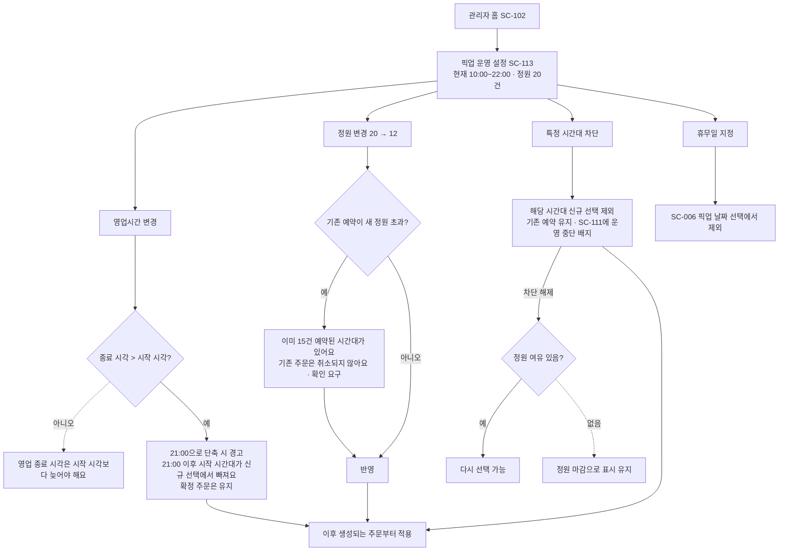

**규칙 반영**
- 운영 설정 변경이 이미 확정된 주문의 픽업 시간을 바꾸거나 취소하지 않는다 (FR-056, FR-057, FR-058).
- 영업시간은 30분 단위로만 설정한다 (BR-014).

---

## 3. 흐름별 예외 경로 정리

| 흐름 | 예외 경로 | 도달 화면 | 처리 |
|---|---|---|---|
| FL-001 | 미로그인 | SC-012 | FL-002로 전환 |
| FL-001 | 주문 제한 계정 | SC-004 시트 | 해제 예정 시각 안내, 주문서 생성 안 함 |
| FL-001 | 재고 부족·품절 | SC-004 시트 | 부족 품목·수량 안내, 부분 선점 없음 |
| FL-001 | 선택 가능 시간대 없음 | SC-006 빈 상태 | 사유 3종 구분 안내, 주문서 포기 유도 |
| FL-001 | 금액 불일치 | SC-007 시트 | 결제 진행 안 함, 주문서 재확인 |
| FL-001 | 결제 직전 정원 소진 | SC-007 시트 | SC-006으로 되돌려 다른 시간대 선택 |
| FL-003 | 선점 10분 경과 | SC-005·SC-006·SC-007 공통 시트 | EXPIRED, 재고 복구, SC-004 복귀 |
| FL-004 | 결제 실패 1~2회 | SC-007 시트 | 선점 유지, 남은 시간·남은 횟수 표시 |
| FL-004 | 결제 3회 실패 | SC-007 전체 화면 | FAILED, 선점 즉시 해제 |
| FL-004 | 결제 무응답 | SC-007 시트 | 실패로 간주하고 횟수 1회 차감 |
| FL-005 | 취소 마감 경과 | SC-010·SC-011 | 취소 버튼 비활성, 기준 시각 안내 |
| FL-005 | 마감 시각 이후 취소 | SC-011 | 취소는 되되 재고 복구 없음 |
| FL-006 | 노쇼 3회 누적 | SC-001 배너·SC-014 카드 | 7일 주문 제한, 해제 예정 시각 표시 |
| FL-101 | 재고 미등록 상태 판매 시도 | SC-103 | ON_SALE 전환 거부 |
| FL-101 | 재고 과소 축소 | SC-105 | 최소 가능 값 안내, 거부 |
| FL-102 | 이미 완료·노쇼 | SC-109·SC-110 | 상태 안내, 처리 거부 |
| FL-103 | 사유 미입력 | SC-110 시트 | 취소 실행 안 함 |
| FL-104 | 중복 노쇼 처리 | SC-112 | 이력 중복 생성 없음 |
| FL-105 | 정원 축소로 기존 예약 초과 | SC-113 | 확인 요구 후 반영, 기존 주문 유지 |

---

## 4. 화면 진입·이탈 정합성

`06-screen-list.md`의 진입·이탈 정의와 본 문서의 전이가 어긋나지 않도록 아래를 확인한다.

| 확인 항목 | 결과 |
|---|---|
| 모든 고객 화면에 최소 1개의 진입 경로가 흐름도에 있다 | 충족 (SC-001~SC-015) |
| 모든 관리자 화면에 최소 1개의 진입 경로가 흐름도에 있다 | 충족 (SC-101~SC-113) |
| 종료 상태(COMPLETED·CANCELED·NO_SHOW·EXPIRED·FAILED) 각각에 도달하는 흐름이 있다 | 충족 (FL-001, FL-003, FL-004, FL-005, FL-006, FL-102) |
| 되돌릴 수 없는 전이가 흐름도에서 역방향으로 그려지지 않았다 | 충족 |
| 고객 흐름과 관리자 흐름이 같은 다이어그램에 섞이지 않았다 | 충족 |

---

## 5. 도달 불가 화면 점검

| 화면 | 유일한 진입 경로 | 비고 |
|---|---|---|
| SC-011 | SC-010 `주문 취소하기` | CONFIRMED·READY이고 취소 마감 전일 때만 노출 |
| SC-013 | SC-012 `회원가입` | 독립 진입점을 두지 않는다 |
| SC-106 | SC-105 `이력 보기` | 선택 우선순위 FR-047에 대응 |
| SC-107 | SC-102, SC-104 | 두 경로 모두 유지한다 |

도달 불가 화면은 없다.

---

## 6. 고객 흐름과 관리자 흐름의 접점

두 흐름은 화면을 공유하지 않고 **상태 변화로만** 만난다.

| # | 접점 | 관리자 쪽 행위 (화면) | 고객 쪽 결과 (화면) |
|---|---|---|---|
| T1 | 상품 판매 상태 변경 | SC-103에서 ON_SALE ↔ HIDDEN | SC-001·SC-002 노출 여부 변경 |
| T2 | 재고 수량 조정 | SC-105에서 총 재고 변경 | SC-001·SC-003 잔여 수량 표시 변경 |
| T3 | 주문 확정 | SC-108·SC-111 목록에 추가됨 | SC-008에서 픽업 번호 수령 |
| T4 | 픽업 완료 처리 | SC-109·SC-110에서 COMPLETED | SC-010 상태가 픽업 완료로 변경 |
| T5 | 관리자 취소 | SC-110에서 사유 입력 후 취소 | SC-010에 취소 사유 표시 |
| T6 | 노쇼 자동 전환 | SC-112 노쇼 목록에 표시 | SC-010 노쇼 안내, SC-014 제한 카드 |
| T7 | 운영 설정 변경 | SC-113에서 영업시간·정원·차단 | SC-006 시간대 칩 선택 가능 여부 변경 |

---

## 가정 / 미확정

### 가정 (확인 필요)

| # | 가정한 내용 | 근거 | 틀릴 경우 영향 |
|---|---|---|---|
| A1 | 로그인·가입 후 복귀 지점을 진입 직전 화면(주로 SC-004)으로 정한다 | 주문 의도를 유지한 채 로그인 절차를 끼워 넣기 위함 | 복귀 지점이 홈이면 FL-002의 종료 조건과 SC-012 안내 문구가 바뀐다 |
| A2 | 선점 만료 시 자동으로 SC-004로 이동하지 않고 만료 시트에서 고객이 직접 이동하게 한다 | 화면이 갑자기 바뀌면 만료 사실을 인지하지 못한다 | 자동 이동으로 바꾸면 FL-003 다이어그램의 노드 하나가 줄어든다 |
| A3 | 결제 실패 시트에서 `시간대 다시 고르기`를 제공한다 | 정원 소진 등 시간대 문제로 실패했을 때 되돌아갈 경로가 필요하다 | 제공하지 않으면 SC-007에서 SC-006으로 가는 경로가 사라진다 |
| A4 | SC-111의 시간대 주문 목록에서 준비 완료를 일괄 실행할 수 있게 한다 | 한 시간대에 최대 20건이 있어 개별 진입은 응대 시간을 넘긴다 | FR-051이 2차로 미뤄지면 이 경로를 제거한다 |
| A5 | 관리자 홈(SC-102)의 픽업 번호 빠른 입력을 SC-109와 같은 조회 결과로 연결한다 | 매장 응대 중 가장 빈번한 동작이다 | 제거해도 SC-109 단독 경로로 대체 가능하다 |
| A6 | 고객이 결제 전 주문서를 명시적으로 포기하는 경로(`주문서 포기`)를 SC-005·SC-007에 둔다 | 상태 전이표에 `고객이 주문서 포기 → EXPIRED`가 정의돼 있다 | 경로를 없애면 해당 전이를 사용자가 발생시킬 방법이 없어진다 |

### 미확정 (결정 대기)

| # | 결정이 필요한 사항 | 선택지 | 막히는 작업 |
|---|---|---|---|
| U1 | 선점 만료 임박 안내 시점 | 1분 전 (03·04 문서 임시 채택값 사용) / 3분 전 / 안내 없음 | FL-003 만료 임박 분기 |
| U2 | 결제 실패 시트에서 `주문서 포기`를 함께 노출할지 | 노출 (본 문서 채택) / 재시도만 노출 | FL-004 예외 경로 수 |
| U3 | 관리자 준비 완료 일괄 처리 지원 여부 | 지원 (본 문서 채택) / 개별 처리만 | FL-102 단계 수, SC-111 액션 |
| U4 | 노쇼 전환 예정 주문을 관리자 홈 요약에 포함할지 | 포함 (본 문서 채택) / SC-112에서만 확인 | SC-102 요약 카드 구성 |

### 향후 검토 (첫 버전 범위 밖)

| # | 내용 | 사유 |
|---|---|---|
| F1 | 픽업 도착 알림을 받아 자동으로 준비 완료로 전환하는 흐름 | 제외 범위(지도·위치) |
| F2 | 결제 실패 원인별 분기 흐름(한도 초과·카드 오류 등) | 제외 범위(실제 결제 연동) |
| F3 | 이메일·문자 알림 발송 흐름 | 첫 버전은 서비스 내 표시로 한정 |
