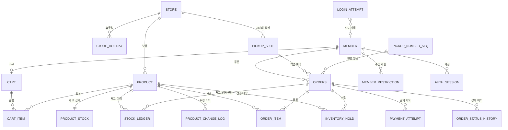

# savePick 데이터 모델 (ERD)

- 문서 ID: 10
- 작성: technical-architect
- 최종 갱신: 2026-08-28
- 선행 문서: 01, 02, 03, 04, 05

## 한 줄 요약
`04-business-rules.md`의 규칙과 `05-state-rules.md`의 상태·수량 변화표를 그대로 강제할 수 있는 19개 엔티티의 스키마, 제약, 인덱스를 정의한다.

---

## 0. 설계 원칙

| # | 원칙 | 근거 |
|---|---|---|
| P1 | 규칙 위반은 애플리케이션 검증 **이전에 DB 제약**으로 막는다 | BR-006, 05 §6.4 C1~C3. 초과 판매는 코드 버그가 있어도 발생하면 안 된다 |
| P2 | 상태값 문자열은 `05-state-rules.md`와 **문자 그대로 일치**시키고 `CHECK` 제약으로 고정한다 | 05 §0-1 |
| P3 | 수량 변화는 **원장(STOCK_LEDGER)** 과 **집계 컬럼(PRODUCT_STOCK)** 을 같은 트랜잭션에서 함께 쓴다 | 05 §0-6, C4 |
| P4 | 종결 처리(확정·해제·복구)는 원장의 유니크 제약으로 **중복 실행을 물리적으로 차단**한다 | 멱등성. 상세는 13번 문서 |
| P5 | 할인율·할인가는 컬럼으로 저장하지 않고 **조회 시점에 계산**한다. 단 주문 품목에는 확정 단가를 스냅샷으로 남긴다 | BR-004(자동 산출), BR-005(주문서 생성 시점 고정) |
| P6 | 매장은 1행만 존재한다(`id = 1`). 매장 분기 로직을 데이터에 만들지 않는다 | BR-001 |

표기 규칙
- 타입은 PostgreSQL 기준으로 적는다. `TIMESTAMPTZ`는 UTC로 저장하고 KST로 해석한다 (BR-028).
- 금액은 원 단위 `INT`, 수량은 `INT`로 둔다. 부동소수점을 쓰지 않는다.
- 테이블 물리명은 스네이크 복수형(`orders`, `order_items`)이며, `ORDER`는 SQL 예약어이므로 물리명을 `orders`로 둔다.

---

## 1. 전체 ERD

### 1.1 엔티티 한 줄 정의

| # | 엔티티 | 물리 테이블 | 역할 |
|---|---|---|---|
| 1 | MEMBER | `members` | 고객·관리자 계정. 로그인 식별자는 이메일 |
| 2 | AUTH_SESSION | `auth_sessions` | 리프레시 토큰 단위의 인증 세션 |
| 3 | LOGIN_ATTEMPT | `login_attempts` | 로그인 시도 기록. 연속 실패 5회 차단 판정 근거 |
| 4 | MEMBER_RESTRICTION | `member_restrictions` | 노쇼 누적으로 인한 주문 제한 기간 |
| 5 | STORE | `stores` | 단일 매장 정보와 운영 설정(영업시간·기본 정원) |
| 6 | STORE_HOLIDAY | `store_holidays` | 휴무일 지정 |
| 7 | PRODUCT | `products` | 판매 상품. 정가·마감 시각·판매 상태 보유 |
| 8 | PRODUCT_STOCK | `product_stocks` | 상품별 재고 4값 집계. **재고 경합의 유일한 락 지점** |
| 9 | STOCK_LEDGER | `stock_ledgers` | 재고 변동 원장. 추가 전용, 멱등성 보증 지점 |
| 10 | PRODUCT_CHANGE_LOG | `product_change_logs` | 상품 정보 수정 이력 |
| 11 | CART | `carts` | 회원 또는 비회원 토큰 단위 장바구니 |
| 12 | CART_ITEM | `cart_items` | 장바구니 담긴 품목과 수량 |
| 13 | PICKUP_SLOT | `pickup_slots` | 30분 단위 픽업 시간대와 정원 카운터 |
| 14 | PICKUP_NUMBER_SEQ | `pickup_number_seqs` | 영업일별 픽업 번호 순번 발급기 |
| 15 | ORDERS | `orders` | 주문. 8개 상태와 픽업·결제 정보 보유 |
| 16 | ORDER_ITEM | `order_items` | 주문 품목과 확정 단가 스냅샷 |
| 17 | INVENTORY_HOLD | `inventory_holds` | 재고 임시 선점 1건(주문×품목). 만료 시각 보유 |
| 18 | PAYMENT_ATTEMPT | `payment_attempts` | 가상 결제 시도 기록(주문당 최대 3건) |
| 19 | ORDER_STATUS_HISTORY | `order_status_histories` | 주문 상태 전이 이력(시각·주체) |

---

## 2. 계정 영역

### 2.1 MEMBER

| 컬럼 | 타입 | 제약 | 설명 |
|---|---|---|---|
| id | BIGINT | PK, 자동 증가 | |
| email | VARCHAR(255) | UNIQUE, NOT NULL | 소문자로 정규화해 저장 |
| password_hash | VARCHAR(255) | NOT NULL | bcrypt 해시. 평문 저장 금지 |
| name | VARCHAR(50) | NOT NULL | 픽업 응대용 |
| phone | VARCHAR(20) | NOT NULL | 숫자만 저장 (`^01[0-9]{8,9}$`) |
| role | VARCHAR(10) | NOT NULL, CHECK IN ('CUSTOMER','ADMIN'), DEFAULT 'CUSTOMER' | BR-002 |
| order_permission | VARCHAR(10) | NOT NULL, CHECK IN ('ALLOWED','RESTRICTED'), DEFAULT 'ALLOWED' | 05 §7. 표시용 캐시 |
| created_at | TIMESTAMPTZ | NOT NULL, DEFAULT now() | |
| updated_at | TIMESTAMPTZ | NOT NULL | |

- 인덱스: `UNIQUE (email)` — 로그인 조회, 가입 중복 검사 (FR-001, FR-002)
- 불변 조건
  - `role`은 가입 API로 `'ADMIN'`이 될 수 없다. 관리자 부여는 운영자 직접 조작(마이그레이션·운영 스크립트)으로만 한다 (FR-004 예외).
  - `email`은 수정 불가. 애플리케이션 계층에서 UPDATE 대상 컬럼에서 제외한다 (FR-003).
  - `order_permission`은 파생값이다. 판정의 정본은 MEMBER_RESTRICTION의 활성 행이며, 이 컬럼과 어긋나면 MEMBER_RESTRICTION을 따른다.

### 2.2 AUTH_SESSION

| 컬럼 | 타입 | 제약 | 설명 |
|---|---|---|---|
| id | UUID | PK | |
| member_id | BIGINT | FK → members.id, NOT NULL, ON DELETE CASCADE | |
| refresh_token_hash | CHAR(64) | UNIQUE, NOT NULL | SHA-256 해시. 원문 저장 금지 |
| issued_at | TIMESTAMPTZ | NOT NULL | |
| last_used_at | TIMESTAMPTZ | NOT NULL | 슬라이딩 만료 기준 |
| expires_at | TIMESTAMPTZ | NOT NULL | `last_used_at + 30일` |
| revoked_at | TIMESTAMPTZ | NULL 허용 | 로그아웃 시각 |
| user_agent | VARCHAR(255) | NULL 허용 | |

- 인덱스: `UNIQUE (refresh_token_hash)` — 재발급 검증 / `(member_id, revoked_at)` — 사용자 세션 전체 폐기 / `(expires_at)` — 만료 세션 정리 배치
- 불변 조건: `expires_at > issued_at`. `revoked_at`이 채워진 행으로는 재발급하지 않는다 (FR-002).

### 2.3 LOGIN_ATTEMPT

| 컬럼 | 타입 | 제약 | 설명 |
|---|---|---|---|
| id | BIGINT | PK | |
| email | VARCHAR(255) | NOT NULL | 존재하지 않는 이메일도 기록한다 |
| member_id | BIGINT | FK → members.id, NULL 허용 | 미가입 이메일이면 NULL |
| succeeded | BOOLEAN | NOT NULL | |
| attempted_at | TIMESTAMPTZ | NOT NULL, DEFAULT now() | |
| client_ip | INET | NULL 허용 | |

- 인덱스: `(email, attempted_at DESC)` — 최근 실패 연속 횟수 판정 (FR-002)
- 불변 조건
  - 차단 판정: 최근 성공 이후의 연속 실패가 5건 이상이고, 5번째 실패 시각 + 10분이 아직 지나지 않았으면 차단한다.
  - 성공하면 그 이후의 연속 실패 카운트는 0으로 간주한다(행 삭제 없이 시각 비교로 판정).
  - 응답에서 이메일 존재 여부를 구분해 알리지 않는다 (FR-002).

### 2.4 MEMBER_RESTRICTION

| 컬럼 | 타입 | 제약 | 설명 |
|---|---|---|---|
| id | BIGINT | PK | |
| member_id | BIGINT | FK → members.id, NOT NULL | |
| reason | VARCHAR(30) | NOT NULL, CHECK IN ('NO_SHOW_ACCUMULATION') | BR-023 |
| trigger_order_id | BIGINT | FK → orders.id, NOT NULL | 제한을 유발한 3회째 노쇼 주문 |
| triggered_no_show_count | SMALLINT | NOT NULL, CHECK = 3 | |
| started_at | TIMESTAMPTZ | NOT NULL | 3회째 노쇼 판정 시각 |
| ends_at | TIMESTAMPTZ | NOT NULL | `started_at + 7일` |

- 인덱스: `(member_id, ends_at DESC)` — 활성 제한 조회 (FR-032) / `UNIQUE (member_id, trigger_order_id)` — 같은 노쇼 사건으로 제한이 두 번 생성되지 않게 한다
- 불변 조건
  - `ends_at > started_at`.
  - 활성 제한 판정은 `ends_at > 서버 현재 시각`인 행의 존재 여부로 한다. 해제 배치가 없어도 시간이 지나면 자동으로 풀린다 (BR-023 "별도 절차 없이").
  - 활성 제한이 이미 있으면 새 제한을 만들지 않는다(중첩 금지). 애플리케이션 계층에서 조건부 INSERT로 처리한다.

---

## 3. 매장·운영 영역

### 3.1 STORE

| 컬럼 | 타입 | 제약 | 설명 |
|---|---|---|---|
| id | SMALLINT | PK, CHECK (id = 1) | BR-001 단일 매장 강제 |
| name | VARCHAR(100) | NOT NULL | |
| address | VARCHAR(255) | NOT NULL | 텍스트만. 좌표·지도 컬럼을 두지 않는다 |
| phone | VARCHAR(20) | NOT NULL | |
| open_time | TIME | NOT NULL, DEFAULT '10:00' | BR-014 |
| close_time | TIME | NOT NULL, DEFAULT '22:00' | BR-014 |
| slot_unit_minutes | SMALLINT | NOT NULL, CHECK (slot_unit_minutes = 30) | BR-014 |
| default_slot_capacity | SMALLINT | NOT NULL, CHECK (>= 1), DEFAULT 20 | BR-016 |
| updated_at | TIMESTAMPTZ | NOT NULL | |

- 인덱스: PK 외 불필요 (1행)
- 불변 조건: `open_time < close_time` (FR-056). `open_time`, `close_time`은 분이 00 또는 30이어야 한다(30분 단위, FR-056).

### 3.2 STORE_HOLIDAY

| 컬럼 | 타입 | 제약 | 설명 |
|---|---|---|---|
| id | BIGINT | PK | |
| store_id | SMALLINT | FK → stores.id, NOT NULL | |
| holiday_date | DATE | NOT NULL | |
| memo | VARCHAR(100) | NULL 허용 | |

- 인덱스: `UNIQUE (store_id, holiday_date)` — 픽업 날짜 선택 시 휴무 판정 (FR-022, FR-056)
- 불변 조건: 이미 확정 주문이 있는 날짜를 휴무로 지정해도 그 주문은 유지한다. 휴무 지정은 신규 슬롯 생성·선택만 차단한다 (FR-056 예외).

### 3.3 PICKUP_SLOT

| 컬럼 | 타입 | 제약 | 설명 |
|---|---|---|---|
| id | BIGINT | PK | |
| store_id | SMALLINT | FK → stores.id, NOT NULL | |
| slot_date | DATE | NOT NULL | 영업일 |
| start_at | TIMESTAMPTZ | NOT NULL | 시간대 시작 |
| end_at | TIMESTAMPTZ | NOT NULL | `start_at + 30분` |
| capacity | SMALLINT | NOT NULL, CHECK (>= 1) | 생성 시 `stores.default_slot_capacity` 복사 |
| reserved_count | SMALLINT | NOT NULL, CHECK (>= 0), DEFAULT 0 | 정원 점유 카운터 |
| blocked | BOOLEAN | NOT NULL, DEFAULT false | 관리자 개별 차단 (FR-058) |
| created_at | TIMESTAMPTZ | NOT NULL | |

- 인덱스: `UNIQUE (store_id, start_at)` — 슬롯 중복 생성 방지, 배치 재실행 안전 / `(slot_date, start_at)` — 날짜별 시간대 목록 조회 (FR-023, FR-055)
- 불변 조건
  - `end_at = start_at + 30분`, `start_at`의 분은 00 또는 30이다 (BR-014).
  - `reserved_count >= 0`은 제약으로 강제한다. **`reserved_count <= capacity`는 제약으로 걸지 않는다.** 관리자가 정원을 줄여 기존 예약이 정원을 넘는 상태가 정상 상태이기 때문이다 (BR-016, FR-057).
  - 정원 초과 판정은 신규 확정 시점에 `reserved_count < capacity`로만 한다.
  - 예약 마감 판정은 `서버 현재 시각 <= start_at - 30분` (BR-015).

### 3.4 PICKUP_NUMBER_SEQ

| 컬럼 | 타입 | 제약 | 설명 |
|---|---|---|---|
| business_date | DATE | PK | 영업일 |
| last_number | SMALLINT | NOT NULL, CHECK (BETWEEN 0 AND 999), DEFAULT 0 | 마지막 발급 번호 |

- 인덱스: PK
- 불변 조건
  - 발급은 `UPDATE ... SET last_number = last_number + 1 WHERE business_date = ? RETURNING last_number` 한 문장으로 수행한다. 행 락으로 중복 발급이 불가능하다 (BR-026).
  - 취소·노쇼로 종료된 주문의 번호는 되돌리지 않는다. `last_number`는 감소하지 않는다 (BR-026).
  - `last_number`가 999에 도달하면 발급을 거부한다(운영상 하루 999건 초과는 발생하지 않는다고 본다).

---

## 4. 상품·재고 영역

### 4.1 PRODUCT

| 컬럼 | 타입 | 제약 | 설명 |
|---|---|---|---|
| id | BIGINT | PK | |
| store_id | SMALLINT | FK → stores.id, NOT NULL | BR-001 |
| name | VARCHAR(100) | NOT NULL | |
| description | TEXT | NULL 허용 | |
| sale_unit | VARCHAR(20) | NOT NULL | 판매 단위 (예: 300g, 1팩) |
| original_price | INT | NOT NULL, CHECK (>= 100) | 정가 (FR-040) |
| closing_at | TIMESTAMPTZ | NOT NULL | 마감 시각 (BR-003) |
| max_order_quantity | SMALLINT | NOT NULL, CHECK (>= 1), DEFAULT 5 | 1회 주문 최대 수량 (BR-009) |
| status | VARCHAR(10) | NOT NULL, CHECK IN ('DRAFT','ON_SALE','HIDDEN','CLOSED'), DEFAULT 'DRAFT' | 05 §5 |
| closed_at | TIMESTAMPTZ | NULL 허용 | CLOSED 전환 시각 |
| created_at | TIMESTAMPTZ | NOT NULL | |
| updated_at | TIMESTAMPTZ | NOT NULL | |

- 인덱스
  - `(status, closing_at)` — ON_SALE 상품의 마감 임박 정렬 목록 (FR-010 기본 정렬, FR-012)
  - `(closing_at) WHERE status <> 'CLOSED'` — 마감 도달 상품을 CLOSED로 바꾸는 배치의 스캔 범위 축소 (BATCH-02, BR-030)
  - `(lower(name) text_pattern_ops)` 또는 `pg_trgm GIN (name)` — 상품명 부분 일치 검색. 대소문자·앞뒤 공백 무시 (FR-011)
- 불변 조건
  - `original_price >= 100` (BR-004 최저 판매가와 정합).
  - 등록·수정 시 `closing_at > 서버 현재 시각` (FR-040, FR-041). 단 이미 CLOSED된 상품의 `closing_at`은 수정 불가 (05 §5.3).
  - `closing_at`의 시각 부분은 매장 영업 종료 시각(`stores.close_time`)을 넘을 수 없다 (BR-003, FR-043).
  - `status = 'ON_SALE'`로 전환하려면 PRODUCT_STOCK 행이 존재하고 `total_quantity >= 1`이어야 한다 (05 §5.3).
  - `CLOSED`는 종료 상태다. `CLOSED → 다른 상태` UPDATE는 애플리케이션 계층에서 거부하고, 상태 전이는 항상 조건부 UPDATE(`WHERE status = 이전상태`)로 실행한다.
  - 할인율·할인가 컬럼을 두지 않는다. 조회 시점에 `closing_at`과 서버 시각의 차이로 계산한다 (BR-004, P5).

### 4.2 PRODUCT_STOCK

상품과 1:1이며 재고 경합의 **유일한 락 지점**이다.

| 컬럼 | 타입 | 제약 | 설명 |
|---|---|---|---|
| product_id | BIGINT | PK, FK → products.id | 1:1 |
| total_quantity | INT | NOT NULL, CHECK (>= 0) | 총 재고 (BR-006) |
| held_quantity | INT | NOT NULL, CHECK (>= 0), DEFAULT 0 | 선점 중 |
| confirmed_quantity | INT | NOT NULL, CHECK (>= 0), DEFAULT 0 | 확정 판매 |
| discarded_quantity | INT | NOT NULL, CHECK (>= 0), DEFAULT 0 | 마감 후 취소로 폐기된 누적 수량 (S8) |
| available_quantity | INT | GENERATED ALWAYS AS (total_quantity - held_quantity - confirmed_quantity) STORED | 판매 가능 |
| updated_at | TIMESTAMPTZ | NOT NULL | |

- 인덱스: PK / `(available_quantity)` — 품절 숨기기 필터와 품절 판정 (FR-012, FR-015)
- 불변 조건 (05 §6.4를 그대로 제약으로 옮긴다)
  - `CHK_stock_non_negative_available`: `total_quantity - held_quantity - confirmed_quantity >= 0` — C1, C2, C3를 한 번에 강제한다. **초과 판매를 막는 최후 방어선이며, 어떤 코드 경로에서도 이 제약을 우회할 수 없다.**
  - `total_quantity = available_quantity + held_quantity + confirmed_quantity`는 생성 컬럼 정의로 항상 성립한다 (C1).
  - `held_quantity`는 INVENTORY_HOLD의 유효한 `HELD` 합계와 같아야 한다. 만료 후 회수 전 구간에서만 실제보다 크며, 이 구간의 보정 방식은 13번 문서 §2에서 정의한다 (C5).
  - 관리자 재고 축소는 `UPDATE ... SET total_quantity = ? WHERE product_id = ?` 실행 시 위 CHECK가 걸리면 거부한다 (BR-025, S2).

### 4.3 STOCK_LEDGER

추가 전용 원장이다. 재고 변동은 반드시 여기에 1행을 남긴다.

| 컬럼 | 타입 | 제약 | 설명 |
|---|---|---|---|
| id | BIGINT | PK | |
| product_id | BIGINT | FK → products.id, NOT NULL | |
| order_id | BIGINT | FK → orders.id, NULL 허용 | 관리자 조정이면 NULL |
| reason | VARCHAR(20) | NOT NULL, CHECK IN ('ADMIN_ADJUST','HOLD','HOLD_RELEASE','HOLD_EXPIRE','CONFIRM','CANCEL_RESTORE','CANCEL_DISCARD') | FR-047 사유 구분 |
| delta_total | INT | NOT NULL, DEFAULT 0 | |
| delta_held | INT | NOT NULL, DEFAULT 0 | |
| delta_confirmed | INT | NOT NULL, DEFAULT 0 | |
| delta_discarded | INT | NOT NULL, DEFAULT 0 | |
| after_total | INT | NOT NULL, CHECK (>= 0) | 반영 후 스냅샷 |
| after_available | INT | NOT NULL, CHECK (>= 0) | |
| after_held | INT | NOT NULL, CHECK (>= 0) | |
| after_confirmed | INT | NOT NULL, CHECK (>= 0) | |
| actor_type | VARCHAR(10) | NOT NULL, CHECK IN ('CUSTOMER','ADMIN','SYSTEM') | 05 §0-4 |
| actor_id | BIGINT | FK → members.id, NULL 허용 | SYSTEM이면 NULL |
| note | VARCHAR(200) | NULL 허용 | 폐기 사유 등 |
| occurred_at | TIMESTAMPTZ | NOT NULL, DEFAULT now() | |

- 인덱스
  - `UNIQUE (order_id, product_id, reason) WHERE order_id IS NOT NULL` — **멱등성 보증 지점.** 같은 주문·같은 품목에 대해 `CONFIRM`, `HOLD_RELEASE`, `HOLD_EXPIRE`, `CANCEL_RESTORE`, `CANCEL_DISCARD`가 두 번 기록될 수 없다. 중복 복구 시도는 유니크 위반으로 실패하고 트랜잭션이 롤백된다 (13번 문서 §5)
  - `(product_id, occurred_at DESC)` — 상품별 재고 이력 조회 (FR-047)
  - `(occurred_at DESC)` — 전체 이력 조회
- 불변 조건
  - UPDATE·DELETE를 하지 않는다. 애플리케이션 DB 계정에 이 테이블의 UPDATE·DELETE 권한을 부여하지 않는다 (FR-047 "수정·삭제 불가").
  - 각 행의 `after_*` 값은 같은 트랜잭션에서 갱신한 PRODUCT_STOCK 값과 일치해야 한다 (05 §0-6).
  - `reason`별 허용 delta 조합은 05 §6.2의 S1~S8 표를 따른다. 예: `CANCEL_RESTORE`는 `delta_confirmed = -N`, `delta_total = 0`; `CANCEL_DISCARD`는 `delta_confirmed = -N`, `delta_total = -N`, `delta_discarded = +N`.

### 4.4 PRODUCT_CHANGE_LOG

| 컬럼 | 타입 | 제약 | 설명 |
|---|---|---|---|
| id | BIGINT | PK | |
| product_id | BIGINT | FK → products.id, NOT NULL | |
| changed_field | VARCHAR(30) | NOT NULL, CHECK IN ('name','description','sale_unit','original_price','closing_at','max_order_quantity','status') | |
| before_value | VARCHAR(255) | NULL 허용 | |
| after_value | VARCHAR(255) | NULL 허용 | |
| actor_id | BIGINT | FK → members.id, NOT NULL | 관리자 |
| changed_at | TIMESTAMPTZ | NOT NULL, DEFAULT now() | |

- 인덱스: `(product_id, changed_at DESC)` — 상품 수정 이력 조회 (FR-041)
- 불변 조건: 추가 전용. `before_value <> after_value`인 항목만 기록한다.

---

## 5. 장바구니 영역

### 5.1 CART

| 컬럼 | 타입 | 제약 | 설명 |
|---|---|---|---|
| id | BIGINT | PK | |
| member_id | BIGINT | FK → members.id, NULL 허용 | 로그인 장바구니 |
| guest_token | UUID | NULL 허용 | 미로그인 장바구니 식별자 (02 A2) |
| created_at | TIMESTAMPTZ | NOT NULL | |
| updated_at | TIMESTAMPTZ | NOT NULL | |

- 인덱스: `UNIQUE (member_id) WHERE member_id IS NOT NULL` — 회원당 장바구니 1개 / `UNIQUE (guest_token) WHERE guest_token IS NOT NULL`
- 불변 조건
  - `CHECK (member_id IS NOT NULL OR guest_token IS NOT NULL)` — 둘 다 NULL인 장바구니는 없다.
  - 로그인 시 `guest_token` 장바구니의 품목을 회원 장바구니로 병합하고 게스트 장바구니를 삭제한다. 병합 시 같은 상품은 수량을 합산하되 `products.max_order_quantity`를 넘지 않게 절단한다 (FR-016, 02 CS-01 7단계).
  - 재고에 어떤 영향도 주지 않는다 (BR-010).

### 5.2 CART_ITEM

| 컬럼 | 타입 | 제약 | 설명 |
|---|---|---|---|
| id | BIGINT | PK | |
| cart_id | BIGINT | FK → carts.id, NOT NULL, ON DELETE CASCADE | |
| product_id | BIGINT | FK → products.id, NOT NULL | |
| quantity | SMALLINT | NOT NULL, CHECK (>= 1) | |
| added_price | INT | NOT NULL | 담은 시점 할인가. 가격 변동 표시용 (FR-018) |
| created_at | TIMESTAMPTZ | NOT NULL | |
| updated_at | TIMESTAMPTZ | NOT NULL | |

- 인덱스: `UNIQUE (cart_id, product_id)` — 같은 상품 재담기 시 합산 (FR-016) / `(cart_id)` — 장바구니 조회
- 불변 조건
  - `quantity <= products.max_order_quantity` (BR-009). DB 제약으로 표현할 수 없으므로 애플리케이션 계층에서 검증한다.
  - 한 장바구니의 품목 수는 10개 이하다 (BR-009). 추가 시점에 `COUNT`로 검증한다.
  - `quantity = 0`으로 수정하면 행을 삭제한다 (FR-017).
  - `added_price`는 표시 비교용이며 결제 금액 산정에 쓰지 않는다. 금액은 항상 주문서 생성 시점에 재계산한다 (BR-005).

---

## 6. 주문 영역

### 6.1 ORDERS

| 컬럼 | 타입 | 제약 | 설명 |
|---|---|---|---|
| id | BIGINT | PK | |
| order_no | VARCHAR(20) | UNIQUE, NOT NULL | 전역 유일 주문 번호 `ORD-YYYYMMDD-NNNNNN` (BR-026) |
| member_id | BIGINT | FK → members.id, NOT NULL | |
| status | VARCHAR(12) | NOT NULL, CHECK IN ('PENDING','CONFIRMED','READY','COMPLETED','CANCELED','EXPIRED','FAILED','NO_SHOW') | 05 §2.1 |
| total_amount | INT | NOT NULL, CHECK (>= 0) | 주문서 생성 시점 확정 금액 (BR-005) |
| contact_name | VARCHAR(50) | NOT NULL | 주문 시점 회원 정보 스냅샷 (FR-003) |
| contact_phone | VARCHAR(20) | NOT NULL | 스냅샷. 회원 정보 수정이 소급되지 않는다 |
| pickup_slot_id | BIGINT | FK → pickup_slots.id, NULL 허용 | 시간대 선택 전에는 NULL |
| pickup_business_date | DATE | NULL 허용 | 픽업 영업일 |
| pickup_number | SMALLINT | NULL 허용, CHECK (BETWEEN 1 AND 999) | 확정 시 발급 (BR-026) |
| hold_expires_at | TIMESTAMPTZ | NULL 허용 | 선점 만료 시각. PENDING에서 NOT NULL |
| payment_attempt_count | SMALLINT | NOT NULL, CHECK (BETWEEN 0 AND 3), DEFAULT 0 | BR-012 |
| cancelable_until | TIMESTAMPTZ | NULL 허용 | `pickup_slot.start_at - 1시간` (BR-018) |
| no_show_due_at | TIMESTAMPTZ | NULL 허용 | `pickup_slot.end_at + 30분` (BR-021) |
| stock_settled_at | TIMESTAMPTZ | NULL 허용 | 선점 해제·복구 등 재고 종결 처리 완료 시각 (멱등 가드) |
| canceled_by | VARCHAR(10) | NULL 허용, CHECK IN ('CUSTOMER','ADMIN') | |
| cancel_reason | VARCHAR(200) | NULL 허용 | 관리자 취소 시 필수 (BR-020) |
| confirmed_at | TIMESTAMPTZ | NULL 허용 | |
| ready_at | TIMESTAMPTZ | NULL 허용 | |
| completed_at | TIMESTAMPTZ | NULL 허용 | |
| canceled_at | TIMESTAMPTZ | NULL 허용 | |
| no_show_at | TIMESTAMPTZ | NULL 허용 | |
| expired_at | TIMESTAMPTZ | NULL 허용 | |
| failed_at | TIMESTAMPTZ | NULL 허용 | |
| created_at | TIMESTAMPTZ | NOT NULL, DEFAULT now() | |
| updated_at | TIMESTAMPTZ | NOT NULL | |

- 인덱스
  - `UNIQUE (order_no)` — 주문 조회 (BR-026)
  - `UNIQUE (member_id) WHERE status = 'PENDING'` — **고객당 유효한 주문서 1건 강제** (FR-019, 03 A9). 두 번째 주문서 생성 요청은 유니크 위반으로 실패한다
  - `UNIQUE (pickup_business_date, pickup_number) WHERE pickup_number IS NOT NULL` — 영업일 내 픽업 번호 유일 (BR-026) 및 픽업 번호 조회 (FR-049)
  - `(member_id, created_at DESC)` — 고객 주문 내역 (FR-027)
  - `(hold_expires_at) WHERE status = 'PENDING'` — 선점 만료 회수 배치 (BATCH-01, BR-008)
  - `(no_show_due_at) WHERE status IN ('CONFIRMED','READY')` — 노쇼 자동 전환 배치 (BATCH-03, BR-021)
  - `(pickup_slot_id, status)` — 시간대별 픽업 현황 (FR-055)
  - `(pickup_business_date, status, pickup_slot_id)` — 관리자 주문 목록 기본 조회(오늘·내일) (FR-048)
- 불변 조건
  - `CHECK (status <> 'PENDING' OR hold_expires_at IS NOT NULL)` — PENDING이면 만료 시각이 반드시 있다.
  - `CHECK (pickup_number IS NULL OR confirmed_at IS NOT NULL)` — 확정되지 않은 주문에는 픽업 번호가 없다 (FR-026, BR-026).
  - `CHECK (status <> 'CANCELED' OR canceled_by IS NOT NULL)` 및 `CHECK (canceled_by <> 'ADMIN' OR cancel_reason IS NOT NULL)` — 관리자 취소 사유 필수 (BR-020).
  - `total_amount = SUM(order_items.line_amount)` — 결제 금액 일치 (BR-029). 주문서 생성 트랜잭션에서 검증한다.
  - 모든 상태 전이는 조건부 UPDATE(`WHERE id = ? AND status = 이전상태`)로 실행하고 영향 행 수가 1일 때만 후속 처리를 한다. 05 §2.3의 금지 전이는 이 조건으로 자동 차단된다.
  - 부분 취소가 불가능하므로 품목 단위 상태 컬럼을 두지 않는다 (BR-024).

### 6.2 ORDER_ITEM

| 컬럼 | 타입 | 제약 | 설명 |
|---|---|---|---|
| id | BIGINT | PK | |
| order_id | BIGINT | FK → orders.id, NOT NULL, ON DELETE RESTRICT | |
| product_id | BIGINT | FK → products.id, NOT NULL | |
| product_name | VARCHAR(100) | NOT NULL | 주문 시점 상품명 스냅샷 |
| sale_unit | VARCHAR(20) | NOT NULL | 스냅샷 |
| quantity | SMALLINT | NOT NULL, CHECK (>= 1) | |
| original_unit_price | INT | NOT NULL, CHECK (>= 100) | 주문 시점 정가 스냅샷 |
| discount_rate | SMALLINT | NOT NULL, CHECK IN (0, 30, 50, 70) | 적용 할인 구간 (BR-004) |
| unit_price | INT | NOT NULL, CHECK (>= 100) | 확정 단가 (BR-004 계산 결과) |
| line_amount | INT | NOT NULL, CHECK (>= 0) | `unit_price × quantity` |
| product_closing_at | TIMESTAMPTZ | NOT NULL | 주문 시점 마감 시각 스냅샷 (이력용) |

- 인덱스: `UNIQUE (order_id, product_id)` — 같은 상품이 한 주문에 두 줄로 들어가지 않는다 / `(order_id)` — 주문 상세 / `(product_id)` — 상품별 판매 집계
- 불변 조건
  - `line_amount = unit_price * quantity` (BR-029).
  - `unit_price = GREATEST(100, floor(original_unit_price * (100 - discount_rate) / 100 / 10) * 10)` (BR-004).
  - 주문 생성 후 어떤 컬럼도 수정하지 않는다. 관리자의 상품 정가·마감 시각 수정이 소급되지 않는다 (FR-041, BR-005).
  - 재고 복구 판정(BR-019)은 이 스냅샷이 아니라 **현행 `products.closing_at`** 과 취소 실행 시각을 비교해 판단한다. 관리자가 마감 시각을 조정한 경우 현행 값이 판매 가능 여부의 실제 기준이기 때문이다.

### 6.3 INVENTORY_HOLD

| 컬럼 | 타입 | 제약 | 설명 |
|---|---|---|---|
| id | BIGINT | PK | |
| order_id | BIGINT | FK → orders.id, NOT NULL | |
| product_id | BIGINT | FK → products.id, NOT NULL | |
| quantity | SMALLINT | NOT NULL, CHECK (>= 1) | 선점 수량 |
| status | VARCHAR(10) | NOT NULL, CHECK IN ('HELD','CONSUMED','RELEASED','EXPIRED') | 05 §3.1 |
| expires_at | TIMESTAMPTZ | NOT NULL | 생성 시각 + 10분 (BR-007) |
| settled_at | TIMESTAMPTZ | NULL 허용 | HELD를 벗어난 시각 |
| created_at | TIMESTAMPTZ | NOT NULL, DEFAULT now() | |

- 인덱스
  - `UNIQUE (order_id, product_id)` — 주문×품목당 선점 1건 (05 §3, A4)
  - `(expires_at) WHERE status = 'HELD'` — **만료 회수 배치와 지연 정리의 주 인덱스** (BR-008)
  - `(product_id, status)` — 상품별 활성 선점 합계 재계산·정합성 점검
- 불변 조건
  - 같은 `order_id`의 모든 선점은 동일한 `expires_at`을 가진다 (05 §3.4-4).
  - `expires_at = created_at + 10분`이며 UPDATE로 늘리지 않는다. 연장 없음 (BR-007, 05 §3.3).
  - `HELD`에서만 다른 상태로 전이한다. `CONSUMED`, `RELEASED`, `EXPIRED`는 종료 상태이며 역전이하지 않는다 (05 §3.3). 상태 전이는 `WHERE id = ? AND status = 'HELD'` 조건부 UPDATE로 실행한다.
  - `status = 'HELD' AND expires_at <= 현재 시각`인 행은 회수 전이라도 `선점 중` 계산에서 제외한다 (05 §6.4 C5). 계산 방식은 13번 문서 §2.
  - `SUM(quantity) WHERE status = 'HELD' AND expires_at > now()` = `product_stocks.held_quantity`(회수 완료 기준)여야 한다.

### 6.4 PAYMENT_ATTEMPT

| 컬럼 | 타입 | 제약 | 설명 |
|---|---|---|---|
| id | BIGINT | PK | |
| order_id | BIGINT | FK → orders.id, NOT NULL | |
| attempt_no | SMALLINT | NOT NULL, CHECK (BETWEEN 1 AND 3) | BR-012 |
| status | VARCHAR(10) | NOT NULL, CHECK IN ('REQUESTED','SUCCEEDED','FAILED') | 05 §4.1 |
| requested_amount | INT | NOT NULL, CHECK (>= 0) | 요청 금액 |
| idempotency_key | VARCHAR(64) | UNIQUE, NOT NULL | 클라이언트 재전송 중복 방지 |
| failure_reason | VARCHAR(30) | NULL 허용, CHECK IN ('DECLINED','TIMEOUT','SYSTEM_ERROR') | 무응답은 TIMEOUT (BR-011) |
| requested_at | TIMESTAMPTZ | NOT NULL | |
| resolved_at | TIMESTAMPTZ | NULL 허용 | |

- 인덱스: `UNIQUE (order_id, attempt_no)` — 4회째 시도 생성 불가 (05 §4.4) / `UNIQUE (order_id) WHERE status = 'SUCCEEDED'` — **주문당 성공 기록 1건** (05 §4.3-3) / `UNIQUE (idempotency_key)` / `(order_id, attempt_no)` — 결제 이력 조회 (FR-050)
- 불변 조건
  - `attempt_no`는 `orders.payment_attempt_count + 1`이며 같은 트랜잭션에서 함께 증가시킨다.
  - `SUCCEEDED` 또는 `FAILED`로 확정된 행은 수정하지 않는다 (05 §4.4).
  - `requested_amount = orders.total_amount`가 아니면 행을 만들지 않는다 (BR-029, 05 §4.3-6).
  - 선점이 만료된 주문에는 행을 만들지 않는다 (05 §4.3-5).

### 6.5 ORDER_STATUS_HISTORY

| 컬럼 | 타입 | 제약 | 설명 |
|---|---|---|---|
| id | BIGINT | PK | |
| order_id | BIGINT | FK → orders.id, NOT NULL | |
| from_status | VARCHAR(12) | NULL 허용, CHECK (주문 상태 8개 중 하나) | 최초 생성 시 NULL |
| to_status | VARCHAR(12) | NOT NULL, CHECK (주문 상태 8개 중 하나) | |
| actor_type | VARCHAR(10) | NOT NULL, CHECK IN ('CUSTOMER','ADMIN','SYSTEM') | 05 §0-4 |
| actor_id | BIGINT | FK → members.id, NULL 허용 | SYSTEM이면 NULL |
| reason | VARCHAR(200) | NULL 허용 | 취소 사유 등 |
| occurred_at | TIMESTAMPTZ | NOT NULL, DEFAULT now() | |

- 인덱스: `UNIQUE (order_id, to_status)` — 같은 상태로 두 번 전이하지 않는다. 배치 재실행·중복 요청 시 이력이 중복 생성되지 않는다 (FR-053) / `(order_id, occurred_at)` — 주문 상세 이력 (FR-028, FR-050)
- 불변 조건
  - 추가 전용. UPDATE·DELETE 권한을 부여하지 않는다.
  - 상태 전이 트랜잭션 안에서 ORDERS UPDATE와 함께 기록한다. 하나만 반영된 결과를 남기지 않는다 (05 §0-6).
  - 결제 1~2회 실패는 상태가 바뀌지 않으므로 여기 기록하지 않고 PAYMENT_ATTEMPT에만 남긴다 (05 §2.2).

---

## 7. 규칙 → 제약 매핑 검증표

| 규칙 | 강제 지점 | 강제 수단 |
|---|---|---|
| BR-001 단일 매장 | `stores` | `CHECK (id = 1)` |
| BR-002 권한 | `members.role` | `CHECK IN ('CUSTOMER','ADMIN')` + 12번 문서 권한 매트릭스 |
| BR-003 마감 시각 | `products.closing_at` | NOT NULL + 애플리케이션 검증(과거 불가, 영업 종료 이내) |
| BR-004 할인 구간 | `order_items.discount_rate` | `CHECK IN (0,30,50,70)`, `unit_price >= 100` |
| BR-005 금액 확정 | `order_items.unit_price` | 스냅샷 컬럼 + 생성 후 UPDATE 금지 |
| BR-006 재고 4값 | `product_stocks` | 생성 컬럼 + `CHECK (total - held - confirmed >= 0)` |
| BR-007 선점 10분 | `inventory_holds.expires_at` | NOT NULL + `expires_at = created_at + 10분`, UPDATE 금지 |
| BR-008 만료 처리 | `orders(hold_expires_at) WHERE PENDING` 인덱스 | 배치 + 지연 정리 (13번 §2) |
| BR-009 수량 한도 | `cart_items`, `order_items` | 애플리케이션 검증 + `quantity >= 1` |
| BR-010 장바구니 비선점 | `cart_items` | 재고 컬럼과 FK·트리거를 연결하지 않는다 |
| BR-011 결제 판정 | `payment_attempts.status` | `CHECK IN ('REQUESTED','SUCCEEDED','FAILED')` |
| BR-012 3회 한도 | `payment_attempts` | `CHECK (attempt_no BETWEEN 1 AND 3)` + `UNIQUE (order_id, attempt_no)` |
| BR-013 픽업 D+0~D+1 | `pickup_slots.slot_date` | 슬롯 생성 배치가 D+1까지만 생성 + 애플리케이션 검증 |
| BR-014 30분 단위 | `pickup_slots` | `CHECK (slot_unit_minutes = 30)` + `UNIQUE (store_id, start_at)` |
| BR-015 예약 마감 | 조회·확정 시점 | `now() <= start_at - 30분` 검증 |
| BR-016 정원 | `pickup_slots.reserved_count` | `CHECK (>= 0)` + 확정 시 `reserved_count < capacity` |
| BR-017 마감·슬롯 정합 | 조회·확정 시점 | `slot.start_at <= MIN(order_items 상품의 closing_at)` |
| BR-018 취소 마감 | `orders.cancelable_until` | 확정 시 계산해 저장, 취소 시 비교 |
| BR-019 재고 복구 | `stock_ledgers.reason` | `CANCEL_RESTORE` / `CANCEL_DISCARD` 구분 + 유니크 제약 |
| BR-020 관리자 취소 | `orders.cancel_reason` | `CHECK (canceled_by <> 'ADMIN' OR cancel_reason IS NOT NULL)` |
| BR-021 노쇼 판정 | `orders.no_show_due_at` | 확정 시 계산 + 부분 인덱스 + 5분 주기 배치 |
| BR-022 노쇼 결과 | — | NO_SHOW 전이에서 재고 원장 행을 만들지 않는다 (S10) |
| BR-023 노쇼 제재 | `member_restrictions` | 활성 행 존재 시 주문서 생성 거부 |
| BR-024 부분 취소 불가 | `orders` | 품목 단위 상태 컬럼을 두지 않는다 |
| BR-025 재고 축소 충돌 | `product_stocks` CHECK | 축소 UPDATE가 제약 위반이면 거부 |
| BR-026 번호 발급 | `orders`, `pickup_number_seqs` | `UNIQUE (order_no)`, `UNIQUE (pickup_business_date, pickup_number)` |
| BR-027 재고 경합 | `product_stocks` | 행 락 + CHECK (13번 §3) |
| BR-028 시각 기준 | 전 컬럼 | `TIMESTAMPTZ` + 서버 시각 `now()` 사용, 클라이언트 시각 미신뢰 |
| BR-029 금액 일치 | `payment_attempts.requested_amount` | 주문 `total_amount`와 비교 후 행 생성 |
| BR-030 마감 판매 종료 | `products.status` | `CHECK IN (...'CLOSED')` + BATCH-02 |

---

## 8. 데이터 보존과 정리

| 대상 | 정리 방식 | 주기 |
|---|---|---|
| `login_attempts` | 90일 경과 행 삭제 | 일 1회 |
| `auth_sessions` | `expires_at < now() - 7일` 행 삭제 | 일 1회 |
| `carts` (게스트) | `updated_at < now() - 7일` 인 `guest_token` 장바구니 삭제 | 일 1회 |
| `orders`, `stock_ledgers`, `order_status_histories` | 삭제하지 않는다 (지표 집계·감사 근거) | — |
| `inventory_holds` | 삭제하지 않는다. 상태로만 종결한다 | — |

---

## 가정 / 미확정

### 가정 (확인 필요)

| # | 가정한 내용 | 근거 | 틀릴 경우 영향 |
|---|---|---|---|
| T-A1 | RDBMS는 PostgreSQL 14 이상을 쓴다 | 부분 유니크 인덱스, 생성 컬럼, `SELECT ... FOR UPDATE`가 모두 필요하다 | MySQL을 쓰면 부분 유니크 인덱스를 대체 테이블·트리거로 구현해야 하고 생성 컬럼 제약 표현이 달라진다 |
| T-A2 | 재고 집계값(`product_stocks`)과 선점 원장(`inventory_holds`)을 함께 둔다 | 집계만 두면 이력 추적이 불가능하고, 원장만 두면 매 조회마다 합계 연산이 필요하다 | 한쪽만 남기면 13번 문서의 락 지점과 조회 성능 전제가 바뀐다 |
| T-A3 | 미로그인 장바구니는 `guest_token`(UUID)으로 서버에 저장한다 | 02 A2(로그인 후 장바구니 유지)를 만족하려면 서버 저장이 필요하다 | 브라우저 로컬 저장으로 바꾸면 CART·CART_ITEM에서 게스트 컬럼이 빠지고 병합 API가 필요 없다 |
| T-A4 | 주문 번호 형식은 `ORD-YYYYMMDD-NNNNNN`이다 | 사람이 읽고 문의할 수 있는 형식이 필요하다 (BR-026) | 형식 문자열만 바뀐다 |
| T-A5 | 폐기 수량을 `product_stocks.discarded_quantity` 누적 컬럼으로 유지한다 | 05 §6.2 S8에서 총 재고를 차감하므로 차감분의 사유를 남길 곳이 필요하다 | 원장 집계로만 관리하면 컬럼이 빠지고 재고 현황 조회가 집계 쿼리로 바뀐다 |
| T-A6 | 회원 이름·연락처를 주문에 스냅샷으로 복사한다 | FR-003 "확정된 주문의 픽업 연락처는 수정 결과로 변경되지 않는다" | 스냅샷을 두지 않으면 FR-003 완료 조건을 만족할 수 없다 |
| T-A7 | 재고 복구 판정 기준은 주문 스냅샷이 아니라 현행 `products.closing_at`이다 | 관리자가 마감 시각을 조정하면 실제 판매 가능 여부가 바뀐다 (BR-019) | 스냅샷 기준으로 바꾸면 마감 시각을 늦춘 상품의 취소분이 복구되지 않는다 |
| T-A8 | 주문 상태 이력에 `UNIQUE (order_id, to_status)`를 건다 | 현 상태 기계에서 각 상태는 주문당 최대 1회만 도달한다 (05 §2.2) | 향후 재입고·재확정 같은 반복 전이가 생기면 이 제약을 풀어야 한다 |

### 미확정 (결정 대기)

| # | 결정이 필요한 사항 | 선택지 | 막히는 작업 |
|---|---|---|---|
| T-U1 | 상품 검색 인덱스 방식 | `pg_trgm` GIN (임시 채택) / `LIKE '검색어%'` 전용 B-tree / 별도 검색 엔진 | FR-011 부분 일치 검색 성능. 상품 수가 적어 어느 쪽도 동작하지만 확장 시 달라진다 |
| T-U2 | 상품 이미지 저장 여부 | 스키마에 넣지 않음 (임시 채택) / `image_url` 컬럼 추가 | 06~09 디자인 트랙에서 이미지가 필요하면 PRODUCT에 컬럼 1개가 추가된다. G3에서 확인 |
| T-U3 | `product_stocks.discarded_quantity`를 총 재고 차감과 별도로 유지할지 | 별도 누적 컬럼 (임시 채택) / 원장 집계로만 관리 | 05 U4와 연결된 결정 |
| T-U4 | 픽업 슬롯 사전 생성 범위 | D+1까지 매일 생성 (임시 채택) / D+7까지 미리 생성 | BATCH-05 실행 주기와 실패 시 복구 여유 |
| T-U5 | 장바구니 `added_price` 보관 여부 | 보관 (임시 채택) / 보관하지 않고 변동 표시를 생략 | FR-018 "담은 뒤 가격이 바뀐 품목은 변경 사실을 표시한다" 구현 방식 |

### 향후 검토 (첫 버전 범위 밖)

| # | 내용 | 사유 |
|---|---|---|
| T-F1 | `stores` 다중 행과 상품·슬롯의 매장 분기 | 제외 범위(다중 매장) |
| T-F2 | 환불 원장(REFUND) 테이블 | 제외 범위(실제 결제) |
| T-F3 | 상품 카테고리·태그 테이블 | 상품 수가 적어 첫 버전에 효용이 없다 |
| T-F4 | 알림 발송 이력 테이블 | 03 F6(첫 버전은 서비스 내 표시로 한정) |
